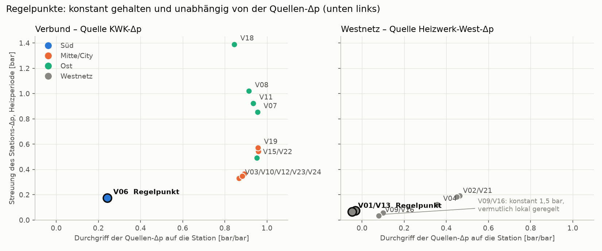
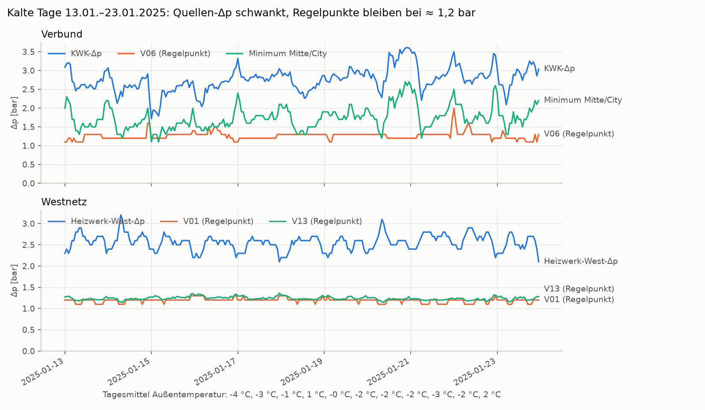
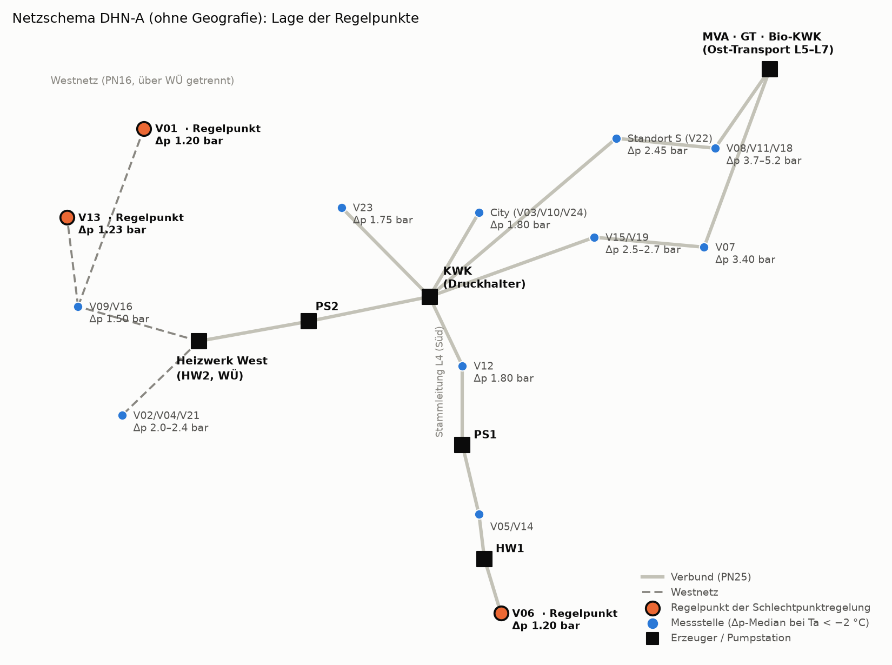

# Datenanalyse DHN-A: Wetter, Auslegungslast, hydraulische Begrenzung und erforderliche KWK-Druckdifferenz

> **Anonymisierung:** Netz „DHN-A“. Verbraucher V01–V24; die Zuordnung zu den Klarnamen liegt nur lokal beim Auftraggeber. Erzeuger nach Typ:
> * KWK = Gas-KWK-Hauptanlage und Druckhalter
> * MVA = Abfallverbrennung
> * GT = Gasturbine
> * Bio-KWK = Biomasse-KWK
> * HW1/HW2 = Heizwerke; HW2 mit Wärmeübertrager zum Sekundärnetz West
> * PS1/PS2 = Pumpstationen
>
> Weitere Bezeichnungen: Speicherstandort **S = Verbraucher V22**; L1–L7 = Haupt- und Transportleitungen; N_… = Modellknoten; A1… = Armaturen; Plan A/B/C = Betreiberpläne (Erzeuger, Netz Mitte, Netz West). Datensatz und Spaltennamen: `data/dhn_a/README.md`.

Stand: 2026-10-01 · Bezug: `Plan_belastbare_Aussagen.md` (Arbeitspakete 1.4, 1.8–1.11, 3.2, 3.4–3.6, 4.1) und `Review_Speicherstudie.md` (Abschnitt 9).

**Hinweis zur Weitergabe:** Der Bericht beruht auf anonymisierten Betreiberdaten (Freigabe für dieses Repository liegt vor). Vor externer Weitergabe gesondert freigeben lassen.

## Datenbasis

| Quelle | Inhalt |
|---|---|
| Leitsystem 2025 | `measurements_2025_hourly.parquet`, 8 759 h × 169 Signale |
| Lastgänge | `generation_profiles_2020_2022_hourly.csv`, stündliche Fernwärmeerzeugung 2020–2022 |
| Wetter | DWD Climate Data Center, Referenzstation, Lufttemperatur stündlich 1955 – 09/2026 |
| Pläne | Plan A (Erzeuger, Stand 2023), Plan B, Plan C; Anschlussleistung je Teilgebiet (`sectors.csv`, Stand 2022) |

Die DWD-Zeitstempel werden in Ortszeit umgerechnet: bis 30.11.1996 MEZ, danach UTC.

**Reproduktion:** Der anonymisierte Datensatz liegt im Repository unter `data/dhn_a/`, einschließlich der Außentemperatur; siehe `data/dhn_a/README.md`. Dann:
```
python -m scripts.dhn_study.run_analyse
python -m scripts.dhn_study.abbildungen      # Abbildungen Abschnitt 5.6 (benötigt matplotlib)
python -m pytest -o addopts="" tests/test_dhn_study.py
```
Laufzeit ≈ 3 s. Die Ergebnisse stehen unter `results/dhn_study/datenanalyse/` (CSV und `zusammenfassung.md`). Der Code liegt in `scripts/dhn_study/` (`daten`, `wetter`, `auslegung`, `anker`, `hydraulik`, `abbildungen`).

---

## 1. Kernergebnis

**Referenzfall** nach Plan A:
* −14 °C, Ausfall der größten Erzeugungseinheit (n−1);
* unbegrenzter Bedarf, gemessener Rücklauf 59 °C;
* das **Sekundärnetz West versorgt sich aus den eigenen Kesseln** (Fahrweise laut Plan A, vom Auftraggeber als Annahme bestätigt).

| Frage | Ergebnis (indikativ, datenbasiert) |
|---|---|
| **F1:** Reicht das Netz bei Auslegungslast? | Das KWK braucht **≈ 3,2–3,6 bar** Druckdifferenz bei 235–252 MW Verbund-Stundenlast. Bei P90 bestimmt der **Süden** die Anforderung. Das liegt unter den **4,0 bar** aus der statischen Worst-Case-Simulation des Betreibers; das Netz reicht also, **knapp**. Gegen die Pumpengrenze **≈ 5,7 bar** reicht es mit deutlicher Reserve (Abschnitt 6). Bezieht das Westnetz wie 2025 Wärme aus dem Verbund, steigt der Bedarf auf 3,9–4,5 bar. |
| Was begrenzt heute an kalten Tagen? | Abschnitt 5. Drei Befunde: (1) Der **Süd-Schlechtpunkt V06** am Südende der Stammleitung L4 steht auf seinem Sollwert von ≈ 1,2 bar. Auf ihn regelt die KWK (Abschnitt 5.6). (2) Die KWK-Δp ist **nicht frei erhöhbar**: Jede bar KWK-Δp hebt die MVA-Δp um 0,8–1,0 bar, und bei laufender GT steht die MVA an ihrem Erfahrungswert (7,5 bar, 2025 P99 8,2 bar). Im Kältebetrieb 2025 liegt die wirksame KWK-Grenze deshalb bei **≈ 3,6–4,3 bar**. (3) Der Betrieb **entlastet den Verbund**, indem er das Westnetz auf die eigenen Kessel umstellt. Bei den Kunden ist 2025 bis −5 °C kein Defizit messbar. 2020–2022 lag die Erzeugung an Tagen unter −5 °C dagegen **10–15 % unter dem unbegrenzten Bedarf**. |
| **F2:** Wie viel Ausbau ist ohne Maßnahmen möglich? | Bis 4,0 bar **+5 % bis +13 %**, bis ≈ 5,7 bar **+24 % bis +34 %**. Mit West-Bezug wie 2025: −5 % bis +1 % bzw. +12 % bis +20 %. |
| Erzeugungsleistung (n−1) | Plan A: 251 MW im Verbund bei Ausfall der größten KWK-Einheit (KWK 50 + 0 + 44 + 33 MW). Im Referenzfall reicht das bei P50. Bei P90 fehlen ≈ 10–20 MW über ≈ 4 h (**30–60 MWh**). Mit KWK im Umleitbetrieb (267 MW) bleibt praktisch keine Lücke. Nur mit West-Bezug wie 2025 fehlen 80–230 MWh. |
| **F3:** Was bringt der Speicher am Standort S? | **Hydraulisch wenig:** Eine Einspeisung im Osten, wo S liegt, hebt den Regelpunkt V06 nur um ≈ 0,03 bar je 100 kg/s; im Süden wären es 0,85 bar. 40 MW am Standort S senken die KWK-Δp um **≈ 0,08 bar (0,04–0,11)**, also ≈ 1 Prozentpunkt Ausbaureserve. **Thermisch:** n−1-Reserve für die P90-Spitze, 30–60 MWh. Wirksamer für den Engpass sind Maßnahmen im Süden (Abschnitt 7). |
| **F4:** Druck am Standort S | Vorlaufdruck 2025 max. 12,0 bar. Bei Auslegung (KWK-Δp 3,6–4,0 bar, Ruhedruck 8,4–9,1 bar) 11,6–12,8 bar, bis ≈ 14 bar, wenn die KWK bis zur Pumpengrenze fährt. Das ist die Eingangsgröße für den Auslegungsdruck eines direkt angebundenen Speichers (Konzept K1). |
| Status der Δp-Grenzen | Plan A: Umwälzungen, Δp und Rücklauftemperaturen sind **„derzeitige Erfahrungswerte“**. Laut Betreiber stammen sie aus Erfahrung und statischen Worst-Case-Simulationen. 4,0 bar (KWK) und 7,5 bar (MVA) sind also **keine physikalischen Grenzen**; beide wurden 2025 überschritten. Harte Grenzen sind die Pumpen (KWK ≈ 5,7 bar bei 73,5 m), die Abschaltdrücke Ost (VL 19,5–22 bar, RL 4,4–5,0 bar), PN25 und der Mindest-Ruhedruck. |
| Stärkste Stellhebel | **Westnetz bei Kälte aus eigenen Kesseln:** ≈ −25 MW Verbundlast, entspricht ≈ −0,7…0,9 bar. **Rücklauf:** −5 K ≈ −0,3 bar, +5 K ≈ +0,5 bar. **HW1/PS1** im Süden: ≈ 1 bar je 100 kg/s HW1. **Ost-Vorlauf über der Heizkurve:** nur im heutigen Kältebetrieb, ≈ +0,8 bar wirksame KWK-Grenze. |

Einschränkungen:
* Alle Aussagen beruhen auf **Ersatzgesetzen** aus dem Betriebsbereich 2025, nicht auf dem Netzmodell. Bei Auslegung wird bis zum 1,2- bis 1,3-fachen Massenstrom extrapoliert (bei West-Bezug wie 2025 bis 1,45-fach).
* Das Süd-Gesetz ist das **heutige Regelverhalten**. Ein anderer Sollwert am Schlechtpunkt verschiebt es.
* Die Aussagen sind deshalb **Plausibilitätsanker**, die das konsistente Netzmodell (Plan, Phase 2/3) reproduzieren muss.

---

## 2. Wetter Referenzstation und Auslegungstemperatur

Tiefste n-Tage-Mittel der Lufttemperatur je Jahr, 1991–2025:

| Dauer | Minimum | Jahr | 10-%-Quantil der Jahresminima | Median | Jahre < −10 °C |
|---|---|---|---|---|---|
| 1 Tag | −17,0 °C | 2012 | −14,5 °C | −10,2 °C | 19 |
| 2 Tage | −16,2 °C | 2012 | −13,9 °C | −9,0 °C | 14 |
| 3 Tage | −15,8 °C | 2012 | −12,7 °C | −8,1 °C | 11 |
| 5 Tage | −15,1 °C | 2012 | −11,4 °C | −7,1 °C | 9 |

* Ein **Tagesmittel von −14 °C** entspricht etwa einem **10-Jahres-Kältetag**. Ein 5-Tage-Mittel von −11 °C tritt ebenso etwa einmal in 10 Jahren auf. Das ist der Ansatz für die **Auslegungswoche** (Speicher-Mehrtagesbetrieb).
* Kältester Tag der Messjahre: **2025 nur −5,6 °C** (31.12.) – das Jahr war mild und deckt den Auslegungsfall nicht ab. 2021 erreichte −10,2 °C (12.02.).
* Der Basistag der Studie (14.02.2025) hatte nach DWD ein Tagesmittel von −1,5 °C; die Studie nennt −3,7 °C aus ihrer eigenen Temperaturreihe.

## 3. Heizkurve und Auslegungsspreizung

KWK-Vorlauftemperatur 2025 (Median) gegen DWD-Tagestemperatur:

| T_a-Klasse | −11 | −9 | −7 | −5 | −3 | −1 | +1 | +5 | +9 | +13 °C |
|---|---|---|---|---|---|---|---|---|---|---|
| VL gemessen | 121 | 123 | 118 | 115 | 113 | 111 | 110 | 102 | 96 | 95 °C |
| Vorgabe 110 − T_a (90…120) | 120 | 119 | 117 | 115 | 113 | 111 | 109 | 105 | 101 | 97 °C |
| RL gemessen | 59,4 | 59,6 | 59,0 | 58,9 | 58,9 | 58,7 | 58,7 | 58,9 | 60,1 | 62,5 °C |

* Mit DWD-Temperaturen folgt der Betrieb im Winter der **Vorgabe-Heizkurve**: ≈ 120 °C ab −10 °C.
* Der Rücklauf ist praktisch konstant bei ≈ 59 °C.
* Die Auslegungsspreizung am KWK beträgt damit **≈ 61 K** (120/59 °C). Die „107 °C“ in Plan A beziehen sich auf den Arbeitspunkt der Angabe „2350 t/h = 127 MW“ und sind nicht die Fahrweise. Das klärt Review N5.
* **Rücklauf aus Messdaten:** Bei Ta < −5 °C liegt der KWK-Rücklauf im Median bei **59,1 °C** (P90 59,9 °C). Mit 120 °C Vorlauf ergibt das **60,9 K** bzw. 60,1 K. Diese Werte gehen direkt in Abschnitt 6 ein, statt einer angenommenen Spreizung. Unterhalb +5 °C hängt der Rücklauf kaum von der Außentemperatur ab; die Extrapolation auf −14 °C ist daher unkritisch.
* Die Ost-Erzeuger folgen 2025 der Heizkurve: ≈ 109–115 °C bei −2 … −5 °C. Plan A nennt für −14 °C 125 °C (MVA, GT) bzw. 120 °C (Bio-KWK). Bei Auslegung ist der Ost-Vorlauf also ohnehin hoch. Im heutigen Kältebetrieb wäre ein Ost-Vorlauf über der Heizkurve ein Hebel, weil er den Ost-Massenstrom senkt (Abschnitt 5.2).

## 4. Auslegungslast

Regression der Tagesmittelleistung auf das Tagesmittel der Außentemperatur, Tage unter 12 °C, mit Wochenend-Term. „Ta_eff“ steht für 0,5·T + 0,3·T(−1 d) + 0,2·T(−2 d). Das Modell **linear unbegrenzt** wird nur auf Tagen ≥ 0 °C angepasst, mit zusätzlichem Term für die Ferienzeit 23.12.–06.01. Es beschreibt den Bedarf ohne hydraulische Begrenzung.

| Reihe | Modell | Steigung [MW/K] | σ [MW] | P50 bei −14 °C | P90 bei −14 °C |
|---|---|---|---|---|---|
| Lastgang 2020–2022 (Erzeugung gesamt) | linear | −6,6 | 12,3 | 223 MW | 239 MW |
| Lastgang 2020–2022 | quadratisch | | | 196 MW | 212 MW |
| Lastgang 2020–2022 | **linear unbegrenzt** | −7,1 | 12,3 | 231 MW | 247 MW |
| 2025 gesamt (korrigiert) | linear | −7,3 | 11,8 | 240 MW | 254 MW |
| 2025 gesamt | quadratisch | | | 222 MW | 237 MW |
| 2025 gesamt | **linear unbegrenzt** | −7,4 | 12,1 | 241 MW | 257 MW |
| 2025 Verbund (ohne HW2-Kessel) | linear | −6,6 | 12,1 | 223 MW | 238 MW |
| 2025 Verbund | quadratisch | | | 186 MW | 201 MW |
| 2025 Verbund | **linear unbegrenzt** | −7,0 | 12,4 | 230 MW | 246 MW |

**Abflachung an kalten Tagen.** Die Abweichung kalter Werktage vom unbegrenzten Bedarf ist ohne Ferienzeit gebildet; „Lastgang“ ist die Erzeugung gesamt.

| Reihe | T_a-Klasse | Tage | Abweichung |
|---|---|---|---|
| Lastgang 2020–2022 | < −8 °C | 2 | −30 MW (−15 %) |
| Lastgang 2020–2022 | −8 … −5 °C | 4 | −17 MW (−10 %) |
| Lastgang 2020–2022 | −5 … −2 °C | 17 | −2 MW (−2 %) |
| 2025 gesamt | −5 … −2 °C | 6 | +1 MW (0 %) |
| 2025 Verbund | −5 … −2 °C | 6 | −7 MW (−4 %) |

* Die Abflachung ist **kein Ferieneffekt**. Die Weihnachtszeit liegt eher über der Geraden.
* Sie tritt **unter ≈ −5 °C** auf. 2025 gab es keinen solchen Werktag (kältester Tag 31.12. mit −5,6 °C).
* 2025 ist das Verbund-Minus bei −5 … −2 °C **vollständig eine Verlagerung**: Der Bezug West über den WÜ sinkt um 8 MW, die HW2-Kessel liefern 7 MW mehr (Abschnitt 5.4).
* Das deckt sich mit der Betreiberaussage, dass die Hydraulik an kalten Tagen begrenzt. Der Lastgang unterschätzt dann den Bedarf. **Für die Auslegung gilt deshalb „linear unbegrenzt“**; das quadratische Modell beschreibt nur die heute begrenzte Lieferung.

**Westnetz bei Auslegung.** Plan A nennt für −14 °C (n−1) drei Fahrweisen des Westnetzes:
* 2 Kessel allein: 40 MW;
* 2 Kessel + 1 WÜ mit Export in den Verbund: 31 MW West-Last + 9 MW Export;
* 2 Kessel + 2 WÜ mit Bezug aus dem Verbund: 64 MW, davon bis 24 MW Bezug.

| Reihe | Modell | Steigung [MW/K] | P50 bei −14 °C | P90 bei −14 °C |
|---|---|---|---|---|
| 2025 Verbund ohne West-Bezug | linear unbegrenzt | −6,3 | 205 MW | 219 MW |
| 2025 West (WÜ-Bezug + HW2-Kessel) | linear unbegrenzt | −1,1 | 36 MW | 38 MW |

* Die West-Last erreicht bei −14 °C ≈ 36–38 MW im Tagesmittel und ≈ 41–44 MW in der Stundenspitze. 2025 lag das Maximum bei 30 MW.
* Die HW2-Kessel (40 MW) decken das fast vollständig; Bezug braucht es nur für ≈ 1–4 MW in der Spitze.
* 2025 bezog das Westnetz bei Kälte dagegen 10–28 MW aus dem Verbund, linear extrapoliert ≈ 25 MW bei −14 °C. Diese Fahrweise ist in der Reihe „2025 Verbund“ enthalten.
* **Referenzfall ist deshalb die Plan-A-Fahrweise** (Verbund ohne West-Bezug, Bezug nur über 40 MW): **235–252 MW** Verbund-Stundenlast. Mit West-Bezug wie 2025 sind es 262–280 MW.

**Lastverteilung nach Teilgebieten** (`data/dhn_a/sectors.csv`, Anschlussleistung, Stand 2022):

| Region | City | Süd | Mitte-L3 | Mitte-L2 | Ost-L5 | Mitte-L4 | Ost-L7 | Ost-L6 | L1 | Summe |
|---|---|---|---|---|---|---|---|---|---|---|
| Anschluss [MW] | 98,8 | 73,3 | 58,8 | 51,9 | 42,6 | 38,6 | 12,4 | 9,4 | 6,2 | 392 |
| Anteil | 25 % | 19 % | 15 % | 13 % | 11 % | 10 % | 3 % | 2 % | 2 % | 100 % |

* Ost-L5 enthält den Standort S mit 32,0 MW.
* Das Netzvolumen beträgt 8 875 m³ im Verbund und 1 781 m³ im Westnetz.
* Die Tabelle liefert die **Lastverteilungsschlüssel** für das Netzmodell (Plan 2.4) statt freier Auslastungsfaktoren.
* Der Süden hat 73 MW Anschluss; bei Auslegung (Gleichzeitigkeit ≈ 0,6) entspricht das ≈ 45 MW. Das liegt in der Größe der lokalen Einspeisung HW1 (40 MW). Das erklärt, warum der Süden bei hoher Last nur mit voller HW1 und PS1 zu halten ist und dann die Anforderung bestimmt.

Weitere Befunde:
* Die Lastgänge passen sehr eng zur lokalen Temperatur: r = −0,94 … −0,96 je Jahr. Der Lastgang 2020 läuft ab dem 01.01. fortlaufend durch, einschließlich 29.02.; das bestätigt die Korrelation.
* Das Niveau 2025 liegt bei gleicher Temperatur ≈ 6 % über 2020–2022 (Achsenabschnitt 138 gegen 130 MW). Das deutet auf Netzzuwachs hin; Jahresenergie 2025 ≈ 613 GWh, 2020–2022: 571–670 GWh.
* Das Verhältnis Stundenspitze zu Tagesmittel an Frosttagen liegt bei 1,14 (2025) bzw. 1,17 (2020–2022), P90 1,22–1,28.
* **Auslegungs-Stundenlast Verbund** im Referenzfall (West aus HW2): **235–252 MW** (linear unbegrenzt, P50–P90); 213–229 MW (quadratisch, heute begrenzt). Mit West-Bezug wie 2025: 262–280 MW.

Die Studie nennt für den Basistag 215 MW Tagesmittel; mit den Daten ergeben sich ≈ 169 MW. Ihre Auslegungsangabe von 216 MW (Mittel) und 269 MW (Spitze) liegt im Band, entsteht in den Szenarien aber nicht: Dort bleibt die Last auf dem Basistag (Review 2.1).

## 5. Hydraulische Begrenzung bei Kälte

### 5.1 Welche Grenzen erreicht sind (2025, Anteil der Stunden)

| T_a | Stunden | Ost-Δp ≥ 7,0 bar | Ost-Δp ≥ 7,5 bar | KWK-Δp ≥ 3,5 bar | Süd ≤ 1,1 bar | Mitte ≤ 1,2 bar | GT in Betrieb | Ost-Δp P95 | KWK-Δp P95 |
|---|---|---|---|---|---|---|---|---|---|
| < −2 °C | 517 | 12 % | 5 % | 2 % | 15 % | 7 % | 60 % | 7,4 bar | 3,35 bar |
| −2 … 2 °C | 1 411 | 24 % | 11 % | 4 % | 17 % | 5 % | 61 % | 7,7 bar | 3,45 bar |
| 2 … 8 °C | 1 929 | 21 % | 12 % | 3 % | 15 % | 7 % | 43 % | 7,8 bar | 3,41 bar |
| > 8 °C | 4 799 | 7 % | 4 % | 0,3 % | 8 % | 5 % | 22 % | 7,3 bar | 2,83 bar |

Definitionen:
* Ost-Δp ist die höchste Austritts-Δp von MVA, GT (in Betrieb) und Bio-KWK. In 99 % der Stunden ist das die MVA.
* Süd ist V06, der Regelpunkt der KWK (Abschnitt 5.6); Mitte ist das Minimum der Mitte/City-Stationen.

Befunde:
* Das **KWK** erreicht weder seine 4,0 bar (P95 3,3–3,5 bar) noch seine thermischen Grenzen. Das Tagesmittel liegt bei höchstens 63 MW gegen 127 MW, der Durchfluss bei höchstens 1 000 t/h gegen 2 350 t/h.
* An der Grenze sind dagegen zwei andere Stellen:
  * der **Süd-Schlechtpunkt V06**: Median 1,2 bar (Sollwert), P10 1,1 bar, in 6–7 % der kalten Stunden ≤ 1,0 bar;
  * die **Ost-Pumpen**: die MVA-Δp erreicht bei laufender GT bis 7,8 bar.
* Die Ost-Erzeuger laufen bei Kälte an ihrer thermischen Grenze: MVA ≈ 44 MW, GT 32–37 MW, Bio-KWK 14,5 MW.

### 5.2 Kopplung Ost ↔ KWK

Die Ost-Erzeuger speisen gegen die Druckdifferenz, die das KWK einstellt. Aus 8 354 h ergibt sich (ṁ in kg/s):

Δp_MVA − Δp_KWK = 0,56 + 0,301·(ṁ_Ost/100)² − 0,214·(ṁ_KWK/100)² bar  (R² 0,86, Restfehler P90 0,64 bar)

* Der erste Massenstrom-Term ist der Transportverlust Ost → Verbund. Der zweite ist die Entlastung durch den KWK-Strom bis zum Treffpunkt der Ströme.
* Stündliche Differenzen bestätigen den Durchgriff: **+0,78 bar MVA-Δp je bar KWK-Δp** (SE 0,01, mit Ost-, KWK- und HW1-Massenstrom als Regressoren). Mit strengerem Ausreißerfilter ergibt sich ≈ 0,96.
* Folge: **Die wirksame KWK-Grenze ist min(KWK-Grenze; MVA-Grenze − Ost-Verlust).**
* Auch die MVA-Grenze ist ein Erfahrungswert: 7,5 bar laut Plan A. 2025 wurde sie in 552 h überschritten (P99 8,2 bar, max. 9,0 bar). Aus der Nennförderhöhe 90 m folgen ≈ 7,9 bar.
* Im Kältebetrieb 2025 (Ta < −2 °C, GT in Betrieb, 293 h; ṁ_Ost ≈ 381 kg/s, ṁ_KWK ≈ 217 kg/s) ergibt das **≈ 3,6 bar** (MVA 7,5 bar) bzw. **≈ 4,3 bar** (MVA 8,2 bar). Gefahren wurden im Median 2,8 bar.
* **Hebel Ost-Vorlauf (heutiger Betrieb):** Bei 120 °C statt 114 °C sinkt ṁ_Ost bei gleicher Leistung auf ≈ 343 kg/s. Die wirksame KWK-Grenze steigt damit um ≈ 0,8 bar, auf **≈ 4,4–5,1 bar**. Bei Auslegung fährt Ost laut Plan A ohnehin 120–125 °C; dort liegt die Ost-Grenze bei ≥ 5,4 bar (Abschnitt 6).
* Ebenso wirkt es, Ost-Leistung zum KWK zu verschieben. An den kalten Tagen 17.–19.02.2025 lief die GT nicht: Die MVA-Δp lag nur bei 3,7 bar, KWK (60–63 MW) und HW1 (22 MW) übernahmen.

### 5.3 Schlechtpunktregelung Süd

In der Heizperiode (Ta < 8 °C, 3 799 h) folgt die KWK-Δp dem Gesetz (F = P/ΔT in MW/K):

Δp_KWK = 2,05 + 0,223·F² − 1,03·ṁ_HW1/100 − 0,42·Δp_PS1  (R² 0,65, Restfehler P90 0,48 bar)

* Das Gesetz beschreibt die **heutige Regelung** auf den Süd-Schlechtpunkt V06 (Abschnitt 5.6).
* HW1 entlastet das KWK um ≈ 1 bar je 100 kg/s, PS1 um ≈ 0,4 bar je bar Pumpengewinn. Das passt zu den Netzhebeln (Abschnitt 7: V06 +1,0 bar je 100 kg/s HW1).
* Für die Mitte-Stationen gilt das Verlustgesetz aus Abschnitt 6. Bei hoher Last ist **der Süden** die strengere Anforderung, selbst mit voller HW1-Unterstützung.

### 5.4 Versorgung an kalten Werktagen 2025

Abweichung vom unbegrenzten Bedarf (Fit ≥ 0 °C) an 6 Werktagen mit Ta < −2 °C, außerhalb der Ferienzeit:

| | V05 (Süd) | V14 (Süd) | V07 (Ost-L7) | V22 (S) | V13 (West) | Verbund | gesamt | WÜ Verbund → West | Kessel West (HW2) |
|---|---|---|---|---|---|---|---|---|---|
| Abweichung | +6 % | +1 % | +2 % | +17 % | +6 % | −4 % (−6,5 MW) | 0 % | −44 % (−7,9 MW) | +108 % (+7,4 MW) |

* Die Kunden wurden 2025 bei −2 … −5 °C voll versorgt.
* Der Verbund wurde entlastet, indem das Sekundärnetz West auf die HW2-Kessel umgestellt wurde. Die HW2-Kessel lieferten 2025 höchstens 23 von 40 MW; hier liegt weitere Entlastung.

### 5.5 Mechanismus der Begrenzung

Die Begrenzung an kalten Tagen ist **keine fehlende KWK-Förderhöhe**, sondern das Zusammenspiel dreier Größen:
1. **Süd-Schlechtpunkt V06 auf Sollwert:** Auf ihn regelt die KWK; er bestimmt die KWK-Δp, zusammen mit HW1 und PS1.
2. **Ost-Pumpengrenze:** Weil die Ost-Erzeuger ≈ 1:1 an die KWK-Δp gekoppelt sind, kann das KWK nicht frei nachschieben, solange Ost mit niedrigem Vorlauf und vollem Massenstrom einspeist. Die wirksame Grenze liegt bei ≈ 3,6–4,3 bar statt 4,0 bar; welcher Wert gilt, hängt am MVA-Erfahrungswert (7,5 bar) bzw. der tatsächlichen Pumpengrenze.
3. **Ausweichen im Betrieb:**
   * HW1 einsetzen,
   * West auf HW2 umstellen,
   * an einzelnen Tagen ohne GT fahren.

Unter ≈ −5 °C reichen diese Maßnahmen nach den Lastgängen 2020–2022 nicht mehr: Die Erzeugung liegt dort 10–15 % unter dem Bedarf (Abschnitt 4).

### 5.6 Regelpunkte der Schlechtpunktregelung

Gesucht sind die Stationen, auf die KWK bzw. Heizwerk West ihre Δp regeln. Drei Kennzeichen aus den Stundenwerten der Heizperiode (Ta < 8 °C):
* **Durchgriff:** Ein geregelter Punkt ändert sich kaum mit der Quellen-Δp (stündliche Differenzen), weil die Quelle genau so nachgeführt wird, dass er konstant bleibt.
* **Rückkopplung:** Liegt der Regelpunkt unerwartet niedrig, steigt die Quellen-Δp in der Folgestunde. Der t-Wert „gemeinsam“ stammt aus einem Modell mit allen Stationen und trennt den Regelpunkt von Stationen, die nur mit ihm korrelieren.
* **Netzzugehörigkeit:** Korrelation der stündlichen Vorlaufdruck-Änderungen mit KWK bzw. Heizwerk West. Verbund und Westnetz sind über Wärmeübertrager getrennt und teilen keine Druckschwankungen.

| Netz | Station | Lage | Δp Median / P5 | Streuung | Anteil Minimum | Durchgriff | Rückkopplung t (gemeinsam) |
|---|---|---|---|---|---|---|---|
| Verbund | **V06** | Südende Stammleitung L4 | 1,20 / 1,00 bar | 0,18 bar | **92 %** | **0,24** | **−7,8** |
| Verbund | City/Mitte (V03, V10, V12, V23, V24) | Mitte | 1,8–1,9 / 1,3–1,4 bar | 0,33–0,37 bar | 0–7 % | 0,87–0,89 | −2,7 … +1,9 |
| Verbund | Mitte-L3 und Ost (V07, V08, V11, V15, V18, V19, V22) | Mitte-L3, Ost | 2,6–5,0 bar | 0,5–1,4 bar | 0 % | 0,85–0,96 | −3,4 … +3,2 (uneinheitlich) |
| West | **V01** | Leitungsende W1 (Übergabe-WÜ) | 1,20 / 1,10 bar | 0,07 bar | **97 %** | **−0,03** | −0,6 |
| West | **V13** | Leitungsende W1 | 1,26 / 1,17 bar | 0,07 bar | 3 % | **−0,05** | **−8,1** |
| West | V09, V16 | W1 | 1,50 / 1,50 bar | 0,03–0,06 bar | 0 % | 0,08–0,10 | – (konstant, vermutlich lokal geregelt) |

* **Verbund:** Die KWK regelt auf **V06** am Südende der Stammleitung L4. Sollwert ≈ **1,2 bar** im Winter, 1,3–1,4 bar in der Übergangszeit; im Sommer schwimmt V06 bei 1,4–1,5 bar, weil die KWK-Δp dann an ihrem Minimum (≈ 1,8 bar) liegt. City/Mitte haben 0,6 bar mehr und sind nicht in der Regelung.
* **Westnetz:** Das Heizwerk West regelt auf die beiden Leitungsenden **V01** und **V13** (≈ 1,2–1,3 bar). V01 ist meist das Minimum und so eng geführt, dass es stündlich kaum Rückkopplung zeigt; V13 zeigt sie deutlich.
* **Korrektur:** V01 war bisher dem Süden des Verbunds zugeordnet. Seine Drücke laufen jedoch mit dem Heizwerk West (r = 0,61) und V13 (r = 0,75), nicht mit dem KWK (r = 0,02). V01 gehört zum Westnetz. Die Auswertungen „Süd“ (Abschnitte 5.1, 5.5) verwenden jetzt nur V06; das KWK-Regelgesetz (5.3) ist davon unberührt.
* Die Lage ist im Betreiber-Netzplan bestätigt: An V06 und an beiden West-Leitungsenden sind Δp-Messstellen eingezeichnet. Die Klarnamen liegen nur lokal vor.







Die Abbildungen erzeugt `python -m scripts.dhn_study.abbildungen`.

## 6. Erforderliche KWK-Druckdifferenz und Grenzband

**Mitte-Gesetz.** Aus 7 818 Stunden 2025 angepasst:

Δp_KWK − min Δp_Mitte = a + b·(P/ΔT)², mit a = 0,118 bar und b = 0,1405 bar/(MW/K)².

* P/ΔT ist proportional zum Massenstrom; P ist die Verbundeinspeisung, ΔT die KWK-Spreizung.
* Bestimmtheitsmaß R² = 0,76; Restfehler P90 0,28 bar.
* Mitte-Stationen: V03, V10, V12, V23, V24; gefordert sind 1,0 bar.

**Süd-Gesetz.** Siehe Abschnitt 5.3. Bei Auslegung wird HW1 voll angesetzt (40 MW, 153 kg/s) und PS1 mit 1,7 bar Gewinn (P99 2025).

**Grenzband KWK-Δp.** Plan A bezeichnet Δp-Werte als derzeitige Erfahrungswerte. Laut Betreiber stammen die 4,0 bar aus Erfahrungswerten und **statischen Worst-Case-Simulationen**. Sie sind also der Planungswert des Betreibers für den ungünstigsten Fall, keine physikalische Grenze.

| Grenze | Wert | Herkunft |
|---|---|---|
| Erfahrungswert / Worst Case | 4,0 bar | Plan A, Austritt KWK; statische Worst-Case-Simulation des Betreibers |
| gemessen 2025 | max. 4,16 bar | 5 h über 4,0 bar, ohne bekannte Störung |
| Pumpe | ≈ 5,7 bar | 73,5 m Förderhöhe bei 120 °C (6,8 bar) minus 1,1 bar anlageninterne Verluste |
| Ost-Kopplung | Kältebetrieb 2025: ≈ 3,6–4,3 bar (MVA 7,5–8,2 bar). Auslegung: ≥ 5,4 bar (Ost 84 MW mit 120 °C, MVA 7,5 bar) | Abschnitt 5.2; die Entlastung durch den KWK-Strom ist konservativ nicht über das P99 2025 hinaus extrapoliert |

**Auslegungsfall.** Annahmen:
* T_a −14 °C, n−1 nach Plan A;
* Vorlauf 120 °C, **Rücklauf gemessen 59,1 °C (ΔT 60,9 K)**;
* Ost 84 MW (Plan A: MVA 40, GT 31, Bio-KWK 13), HW1 40 MW, Stunden-Spitzenfaktor 1,14.

| Westnetz | Lastmodell (Verbund, Stunde) | P | P_KWK | erf. Δp Mitte | erf. Δp Süd | maßgebend | Reserve bis 4,0 bar | Reserve bis 5,7 bar |
|---|---|---|---|---|---|---|---|---|
| **aus HW2 (Plan A)** | quadratisch P50 / P90 | 213 / 229 MW | 89 / 105 MW | 2,84 / 3,10 bar | 2,51 / 2,92 bar | 2,84 / 3,10 bar | +24 % / +16 % | +47 % / +37 % |
| **aus HW2 (Plan A)** | linear P50 / P90 | 232 / 250 MW | 108 / 126 MW | 3,16 / 3,48 bar | 3,02 / 3,52 bar | 3,16 / 3,52 bar | +14 % / +6 % | +35 % / +26 % |
| **aus HW2 (Plan A)** | **linear unbegrenzt P50 / P90** | **235 / 252 MW** | 111 / 128 MW | 3,21 / 3,53 bar | 3,09 / 3,60 bar | **3,21 / 3,60 bar** | **+13 % / +5 %** | **+34 % / +24 %** |
| Bezug wie 2025 | linear P50 / P90 | 253 / 271 MW | 129 / 147 MW | 3,55 / 3,90 bar | 3,63 / 4,19 bar | 3,63 / 4,19 bar | +5 % / −2 % | +24 % / +16 % |
| Bezug wie 2025 | linear unbegrenzt P50 / P90 | 262 / 280 MW | 138 / 156 MW | 3,72 / 4,09 bar | 3,90 / 4,49 bar | 3,90 / 4,49 bar | +1 % / −5 % | +20 % / +12 % |

Erläuterungen:
* „Reserve“ ist der Lastzuwachs, bis die maßgebende Anforderung (Mitte oder Süd) die Grenze erreicht.
* **Abgleich mit dem Betreiber:** Der Referenzfall braucht 3,2–3,6 bar. Die statische Worst-Case-Simulation des Betreibers setzt 4,0 bar an. Beide unabhängigen Ansätze liegen damit 0,4–0,8 bar auseinander, und zwar in der erwarteten Richtung: Die Worst-Case-Rechnung ist konservativer.
* Das Süd-Gesetz wird bis zum 1,2- bis 1,3-fachen Massenstrom des Messbereichs extrapoliert, bei West-Bezug bis 1,45-fach.

**Rücklauf-Sensitivität** (Referenzfall linear unbegrenzt P50, 235 MW):

| Rücklauf | ΔT | erf. KWK-Δp | Reserve bis 4,0 bar | Reserve bis 5,7 bar |
|---|---|---|---|---|
| gemessen, Median Ta < −5 °C: 59,1 °C | 60,9 K | 3,21 bar | +13 % | +34 % |
| gemessen, P90: 59,9 °C | 60,1 K | 3,26 bar | +11 % | +32 % |
| Median + 5 K | 55,9 K | 3,71 bar | +4 % | +23 % |
| Median − 5 K | 65,9 K | 2,90 bar | +21 % | +44 % |

**Erzeugungsleistung am Auslegungstag (n−1).** Grundlage:
* Plan A gilt für den Ausfall der größten Erzeugungseinheit; das KWK ist mit 50 + 0 + 44 + 33 = 127 MW angesetzt.
* Die Verbund-Erzeugung beträgt damit 251 MW (KWK 127, MVA 40, GT 31, Bio-KWK 13, HW1 40), mit KWK im Umleitbetrieb (143 MW) 267 MW.
* Gerechnet sind die 22 Werktagsprofile unter −2 °C aus den Lastgängen 2020–2022, skaliert auf das Auslegungs-Tagesmittel des Verbunds.

| Westnetz | Tagesmittel Verbund | Erzeugung | fehlende Leistung, Median / P90 | Stunden | fehlende Energie, Median / P90 |
|---|---|---|---|---|---|
| **aus HW2 (Plan A)** | unbegrenzt P50, 206 MW | 251 MW | 0 / 0 MW | 0 | 0 / 0 MWh |
| **aus HW2 (Plan A)** | unbegrenzt P90, 222 MW | 251 MW | 11 / 19 MW | 4 | **29 / 57 MWh** |
| aus HW2 (Plan A) | unbegrenzt P90, 222 MW | 267 MW | 0 / 3 MW | 0 | 0 / 3 MWh |
| Bezug wie 2025 | unbegrenzt P50, 230 MW | 251 MW | 21 / 29 MW | 6 | 80 / 113 MWh |
| Bezug wie 2025 | unbegrenzt P90, 246 MW | 251 MW | 40 / 49 MW | 12 | 233 / 278 MWh |

* Im Referenzfall ist die thermische Lücke klein und tritt nur bei P90 und n−1 auf.
* Mit allen Einheiten verfügbar (n−0) ist die KWK-Leistung um die ausgefallene Einheit höher (mindestens 50 MW). Dann gibt es keine Lücke.
* Bei P50 hat der Plan-A-Fall stündlich noch ≈ 16 MW Reserve; der HW2-Export (bis 9 MW) ist darin nicht enthalten.

Zum Vergleich gemessen 2025:
* KWK-Δp in Hochlast: P95 3,5 bar, Maximum 4,16 bar.
* Massenstrom-Äquivalent F_max 3,60 MW/K.

## 7. Netzhebel (Validierungsziele, mit korrigierter Last)

Regression auf stündliche Differenzen, n ≈ 5 000 h. Die Spalten geben an, um wie viel bar sich der Kunden-Δp ändert.

| Station | je 100 kg/s HW1 | je bar KWK-Δp | je bar MVA-Δp | je 10 MW Last | je bar PS1-Gewinn |
|---|---|---|---|---|---|
| V06 (Süd) | +1,02 | 0,66 | 0,04 | −0,18 | +0,33 |
| City (V03, V10, V24) | +0,17…0,20 | 0,82 | 0,10 | −0,12…−0,14 | −0,06…−0,07 |
| V12 (L4) | +0,19 | 0,82 | 0,09 | −0,15 | −0,06 |
| V23 (L1) | +0,20 | 0,83 | 0,09 | −0,15 | −0,04 |
| V22 | +0,09 | 0,73 | 0,22 | −0,09 | −0,04 |
| V15 (Mitte-L3) | +0,09 | 0,72 | 0,23 | −0,09 | −0,05 |
| HW2-Prim | +0,37 | 0,73 | 0,03 | −0,16 | +0,02 |

* Gegenüber der ersten Auswertung (Review 9.2, N4, mit fehlerhaftem GT-Signal in der Last) ändern sich die City-Hebel für HW1 (+0,07…0,12 → +0,17…0,20) und MVA (0,03…0,05 → 0,09…0,10).
* Robust sind: V06 ≈ +1 bar je 100 kg/s HW1, KWK-Durchgriff 0,72–0,83, PS1-Wirkung im Süden positiv und upstream negativ.
* Als Validierungsziel gilt daher eine **Spanne**: City +0,07…0,20 bar je 100 kg/s lokale Süd-Einspeisung.

**Einspeise-Hebel.** Die folgende Regression setzt die Einspeisung als Massenstrom an: HW1 (Süd) und Ost-Erzeuger zusammen, bei gleicher Last und KWK-Δp. Ein Koeffizient beschreibt damit, was 100 kg/s **anstelle von KWK-Wasser** an der Station bewirken. Genau das tut ein Speicher, der die Spitze statt der KWK deckt. n ≈ 7 700 h.

| Station | je 100 kg/s im Süden (HW1) | je 100 kg/s im Osten | je bar KWK-Δp |
|---|---|---|---|
| **V06 (Regelpunkt)** | **+0,85** (SE 0,02) | **+0,03** (SE 0,01) | 0,54 |
| City/Mitte (V03, V10, V12, V23, V24) | −0,03 … +0,02 | +0,15 … +0,17 | 0,72 |
| V22 (Standort S) | −0,10 | +0,41 | 0,74 |
| V15 (Mitte-L3) | −0,09 | +0,46 | 0,73 |

* Einspeisung im Süden wirkt am Regelpunkt **≈ 30-mal stärker** als dieselbe Menge im Osten.
* Der Standort S liegt in Ost-L5; sein Wasser stammt zu ≈ 75 % aus dem Osten (Tracer, Abschnitt 8). Eine Speicherentladung dort wirkt deshalb wie eine Ost-Einspeisung.
* **40 MW (≈ 156 kg/s) am Standort S heben V06 um ≈ 0,04 bar.** Unter der heutigen Regelung auf V06 senkt das die KWK-Δp um **≈ 0,08 bar (0,04–0,11 bar)**; das entspricht ≈ 1 Prozentpunkt Ausbaureserve.
* City/Mitte gewinnt ≈ 0,25 bar. Das hilft nur, solange die Mitte maßgebend ist; im Referenzfall liegen Mitte- und Süd-Anforderung nur ≈ 0,1 bar auseinander.
* Die frühere Schätzung „0,1–0,3 bar“ beruhte auf dem City-Hebel. Maßgebend ist aber der Regelpunkt V06.

## 8. Temperatur-Tracer (Ost-Wasseranteil, Winter, n = 287 h)

| Station | V22 | V11 | V15 | V23 | V17 (City) | V12 | V24 | V05 |
|---|---|---|---|---|---|---|---|---|
| Ost-Anteil | 0,75 | 0,85 | 0,64 | 0,49 | 0,28 | 0,31 | 0,09 | 0,14 |
| R² | 0,63 | 0,65 | 0,51 | 0,48 | 0,28 | 0,15 | 0,11 | 0,09 |

Aussagekräftig ist der Tracer nur bei R² ≳ 0,3. Mit 15-min-Werten wird er deutlich schärfer.

## 9. Signalprüfungen

* **Identische Signale:** nur `gas_turbine_heat` = `boiler_plant_2_secondary_heat` (8 757 h).
* **GT-Wärme korrigiert:**

  | Quelle | Anteil der Stunden |
  |---|---|
  | gemessen (V̇·Δh) | 34,8 % |
  | Stillstand (T_VL < 60 °C) | 26,7 % |
  | imputiert über Δp und ΔT (R² = 0,76) | 38,4 % |

* **Einheitentest** (Verhältnis gemessen zu berechnet; 1,00 = passende Einheit):

  | Station | t/h | m³/h im RL | m³/h im VL |
  |---|---|---|---|
  | V07 | 0,999 | 1,01 | 1,04 |
  | V22 | 0,998 | 1,01 | 1,05 |
  | V14 | 0,997 | 1,02 | 1,04 |
  | V05 | 0,999 | 1,01 | 1,04 |
  | HW2-Prim | 0,999 | 1,02 | 1,04 |
  | Bio-KWK | 0,96 | 0,98 | **1,00** |

  Kundenstationen messen also in t/h, das Bio-KWK in m³/h im Vorlauf.

## 10. Folgerungen für Studie und Plan

1. **Auslegungsfall** (mit dem Auftraggeber abgestimmt):
   * −14 °C, n−1 nach Plan A;
   * **unbegrenzter** Bedarf; das quadratische Modell nur als „heutige begrenzte Lieferung“;
   * Westnetz aus den eigenen Kesseln: Verbund **235–252 MW** Stundenlast. West-Bezug wie 2025 (262–280 MW) läuft als Sensitivität;
   * Spreizung aus Messdaten 120/59 °C (Abschnitt 3);
   * zusätzlich eine Auslegungswoche mit 5-Tage-Mittel ≈ −11 °C.
2. **Hauptkennzahl** ist die erforderliche KWK-Δp, und zwar das Maximum aus Mitte-Anforderung und Regelpunkt V06. Sie wird gegen ein **Grenzband** geprüft:
   * 4,0 bar: Worst-Case-Wert des Betreibers;
   * ≈ 5,7 bar: Pumpe;
   * die **Ost-Kopplung**, also die MVA-Δp unter 7,5 bar bzw. ihrer Pumpengrenze.

   Ein Δp-Defizit bei festgehaltenen Drücken ist keine geeignete Kennzahl. Das Netzmodell (Plan, Phase 2) muss reproduzieren:
   * die Ost-Kopplung,
   * die Einspeise-Hebel,
   * die Lage der Regelpunkte V06 (Verbund) und V01/V13 (West).

   Die Lastverteilung übernimmt es aus `sectors.csv`.
3. **Betreiberangaben – Stand:**
   * *Geklärt:*
     * n−1 und Erfahrungswerte (Plan A);
     * Lastabflachung bei Kälte hydraulisch bedingt;
     * West aus eigenen Kesseln bei Auslegung;
     * 4,0 bar aus Erfahrung und statischer Worst-Case-Simulation;
     * Regelpunkte aus den Daten bestimmt (V06; West V01/V13).
   * *Offen, aber nicht ergebnisentscheidend:*
     * Mindest-Δp, das V06 tatsächlich braucht (TAB). ±0,2 bar am Sollwert entsprechen ≈ 3–4 Prozentpunkten Reserve.
     * Pumpenkennlinien von KWK und MVA, nur für Ausbau über +5…13 % nötig.
4. **Speicher am Standort S:**
   * **Hydraulisch** senkt er die KWK-Δp nur um ≈ 0,08 bar (0,04–0,11), weil S auf der Ostseite liegt und der maßgebende Regelpunkt V06 im Süden. Die Aussage der Studie „+0,1…0,2 bar“ ist damit eher zu hoch, die qualitative Aussage „klein und lokal“ ist bestätigt.
   * **Thermisch** deckt er im Referenzfall nur die P90-Spitze bei n−1 (30–60 MWh).
   * Ein Speicher **im Süden** würde am Regelpunkt ≈ 30-mal stärker wirken; Standortvergleich in Phase 5/6.
5. **Alternativen mit gleicher oder höherer Wirkung,** im Maßnahmenvergleich zu rechnen:
   * **HW1 und PS1 im Süden:** ≈ 0,85 bar am Regelpunkt je 100 kg/s HW1;
   * **Rücklauf −5 K:** ≈ −0,3 bar;
   * **Ost-Vorlauf über der Heizkurve** im heutigen Betrieb: ≈ +0,8 bar wirksame KWK-Grenze;
   * Druckerhöhungsstation oder Einspeisung im Süden.
6. **Stand gegen das Ziel der Studie:** siehe `Plan_belastbare_Aussagen.md`, Abschnitt 1.6.
