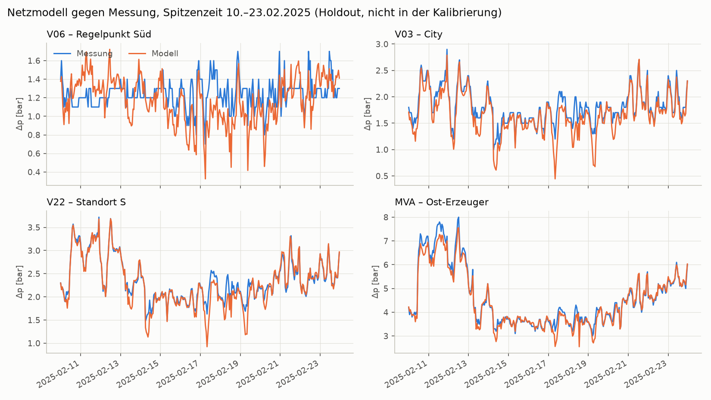
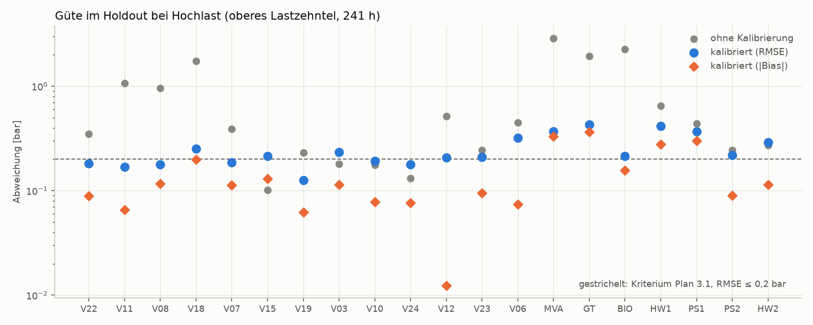
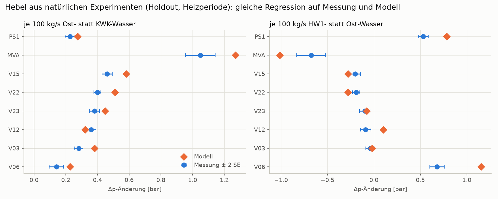
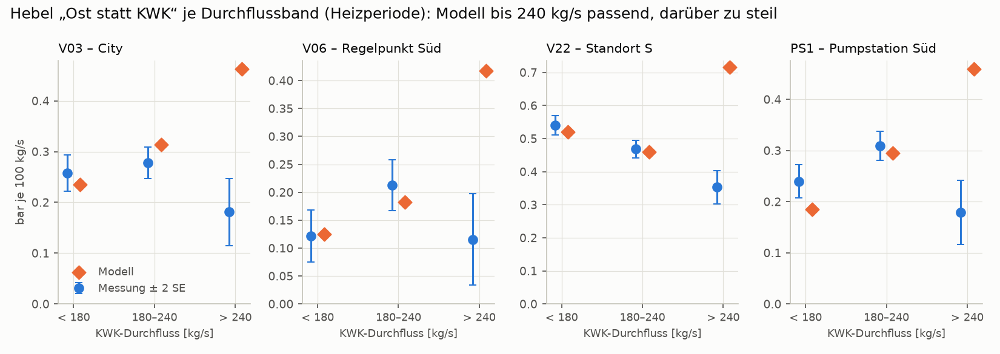
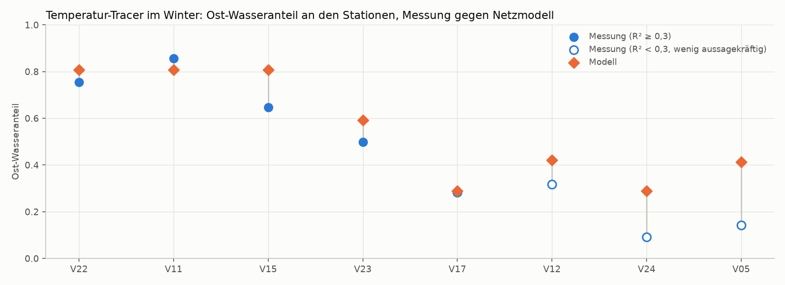
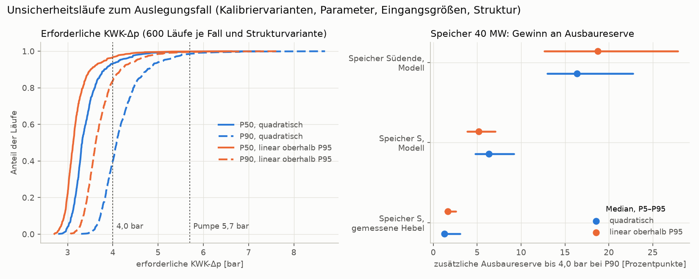

# Netzmodell DHN-A: Ersatznetz, Abgleich mit den Messwerten 2025 und Auslegungsfall

> **Anonymisierung** wie in `Datenanalyse_Auslegung.md`:
> * Netz „DHN-A“, Verbraucher V01–V24.
> * Erzeuger: KWK, MVA, GT, Bio-KWK, HW1/HW2.
> * Pumpstationen PS1/PS2, Speicherstandort **S = V22**.
> * Leitungen L1–L7.
>
> Die Topologie ist ohne Geografie wiedergegeben. Längen und Durchmesser dienen nur als Startwerte.

Stand: 2026-10-07 · Bezug: `Plan_belastbare_Aussagen.md` (Phasen 2–4, Gegenrechnung 2.7, Kriterien 3.1, 3.2, 3.4–3.6), `Datenanalyse_Auslegung.md` (Anker, Hebel, Regelpunkte, Tracer).

**Hinweis zur Weitergabe:** Grundlage sind anonymisierte Betreiberdaten (Freigabe für dieses Repository liegt vor). Vor externer Weitergabe gesondert freigeben lassen.

**Reproduktion** (Repository-Wurzel, Datensatz unter `data/dhn_a/`):
```
pip install -e ".[study]"                                        # einmalig; für die Gegenrechnung zusätzlich pandapipes
python -m scripts.dhn_study.run_netzmodell --ohne-kalibrierung   # veröffentlichte Kalibrierungen, ≈ 1–2 min
python -m scripts.dhn_study.gegenrechnung_pandapipes             # Gegenrechnung, ≈ 1 min; benötigt pandapipes (getestet mit 0.15)
python -m scripts.dhn_study.unsicherheit                         # Unsicherheitsläufe, ≈ 3 min
python -m scripts.dhn_study.abbildungen                          # Abbildungen unter abbildungen/
python -m scripts.dhn_study.mehrfachstart                        # optional: Kalibrierung aus fünf Starts, je ≈ 10–60 min
```
* Die veröffentlichten Kalibrierungen liegen unter `scripts/dhn_study/kalibrierung/`: je Start ein Ordner, dazu `uebersicht.csv` mit den Kosten. Mit `--ohne-kalibrierung` sind alle Zahlen dieses Berichts exakt reproduzierbar.
* `python -m scripts.dhn_study.run_netzmodell` ohne Option kalibriert neu, ausgehend von der Referenzkalibrierung; `--von-null` startet bei den Prior-Werten. Eine Neukalibrierung kann in einem anderen, gleich guten Optimum enden (Abschnitt 3.1).
* Ergebnisse: `results/dhn_study/netzmodell/` (CSV sowie `zusammenfassung.md`, `unsicherheit_zusammenfassung.md`, `pandapipes_zusammenfassung.md`).
* Code:
  * `scripts/dhn_study/netzmodell.py`: Netz, Löser, Kalibrierung, Mischungsrechnung;
  * `run_netzmodell.py`: Ablauf;
  * `mehrfachstart.py`: Kalibrierung aus mehreren Starts;
  * `unsicherheit.py`: Ensemble;
  * `gegenrechnung_pandapipes.py`: geschlossener Kreis in pandapipes.
* Tests: `tests/test_dhn_study.py`.

---

## 1. Kernergebnis

Die Zahlen gelten für die Referenzkalibrierung A. Wo die gleich guten Kalibriervarianten (Abschnitt 3.1) abweichen, steht die Spannweite über alle Varianten dabei.

| Frage | Ergebnis | Nachweis |
|---|---|---|
| Trifft das Modell die gemessenen Zustände? | **Ja, an Mitte- und Ost-Stationen:** Bei Hochlast im Holdout liegt der RMSE bei 0,13–0,25 bar, der Bias bei −0,20 bis +0,01 bar (unkalibriert bis 1,75 bar). Der Regelpunkt V06 hat einen RMSE von 0,32 bar. Die anderen Kalibriervarianten liegen bei 0,10–0,24 bar. | Kriterium 3.1: an 2 von 6 kritischen Stationen erfüllt, an 3 knapp verfehlt (RMSE 0,21–0,23 bar). Abschnitt 4.1 |
| Ist die Kalibrierung eindeutig? | **Nein.** Fünf Starts enden in drei verschiedenen, fast gleich guten Optima; ihre Kosten liegen höchstens 1,6 % auseinander. Sie unterscheiden sich vor allem darin, über welche Verbundkanten Wasser in die Mitte-L4 fließt. Robust sind die stark erhöhten Widerstände von L1 und L3, der Südstrang, die Ost-Leitung L6 und die Lastgewichte von City und Süd. | Abschnitt 3.1. Auslegung und Unsicherheitsläufe sind mit allen drei Varianten gerechnet |
| Trifft es die Wirkung von Einspeiseänderungen? | **Für den Ersatz von KWK- durch Ost-Wasser ja**, solange der KWK-Durchfluss unter 240 kg/s liegt. Das ist der Fall des Speichers S. Abweichung ≤ 0,06 bar an allen Stationen. **Darüber** ist der Modellhebel 2- bis 3,6-mal so groß wie gemessen. **Süd-Hebel:** Der HW1-Hebel ist im Modell rund 40–70 % zu groß. | Kriterium 3.2: 18 von 40 Hebeln, für den Ost-Ersatz 6 von 8. Abschnitte 4.2 und 4.3 |
| Ost-Kopplung | Das Modell trifft das gemessene Gesetz in 92 % der Stunden auf ±0,3 bar (Median −0,17 bar). | Kriterium 3.4 knapp erfüllt. Abschnitt 4.4 |
| Plausibilitätsanker | Das Mitte-Verlustgesetz trifft das Modell auf ±0,07 bar. Beim Süd-Regelgesetz liegt es zwischen −0,39 und +0,18 bar. | Kriterium 3.6: Mitte erfüllt, Süd knapp verfehlt. Abschnitt 4.5 |
| Verbundflüsse (Temperatur-Tracer) | **Bestätigt:** An den vier Stationen mit aussagekräftigem Tracer trifft das Modell den Ost-Wasseranteil auf −5 bis +16 Prozentpunkte (V22 und V11 ≤ 5 Pp, V23 +9 Pp). | Kriterium 3.5 (±15 Pp): 3 von 4 erfüllt, V15 knapp verfehlt. Abschnitt 4.6 |
| Löser und Strukturannahmen (pandapipes) | **Bestätigt:** Der geschlossene Kreis in pandapipes (Vor- und Rücklauf getrennt, eigene Temperaturen) weicht bei gleichem Reibungsgesetz höchstens 0,016 bar ab. Reynoldsabhängige Reibung senkt den Bedarf bei Auslegung nur um 0,03–0,07 bar. | Kriterium 2.7 (≤ 0,05 bar) erfüllt. Abschnitt 4.7 |
| **F1:** erforderliche KWK-Δp bei Auslegung | **Referenz: 3,13–3,38 bar (P50) und 3,75–4,03 bar (P90).** Über alle Kalibriervarianten: 2,99–3,38 bzw. 3,55–4,03 bar. Maßgebend ist knapp die Mitte (V03); V06 liegt dicht dahinter und wird in Variante B bei P90 maßgebend. Die Anker der Datenanalyse liegen bei 3,21 und 3,60 bar. **Unsicherheitsläufe:** P50 2,86–4,16 bar, P90 3,29–5,12 bar (P5–P95 über beide Strukturvarianten). | Reserve bis 4,0 bar: Modell −0,3 % bis +10 %, Anker +5 % bis +13 %. Bis zur Pumpengrenze: Modell +11 % bis +21 %. Abschnitte 5 und 5.2 |
| Ost-Kopplung bei Auslegung | **Nicht begrenzend:** MVA-Δp 3,8–4,4 bar (mit Modellbias ≈ 4,1–4,7 bar) gegen 7,5 bar. Grund: Der hohe KWK-Durchfluss bei Auslegung senkt den Druck am Treffpunkt der Ströme. Auch ohne Anstieg dieses Effekts über den Messbereich hinaus bleibt es bei ≈ 5,2–6,5 bar. | Abschnitt 5 |
| **F3:** Speicher S, 40 MW | Senkt die erforderliche KWK-Δp um **0,16–0,34 bar** mit den gemessenen Hebeln und um **0,6–1,1 bar** im Modell (alle Kalibriervarianten). Die **Ausbaureserve** bis 4,0 bar steigt um **1–2 Prozentpunkte** (gemessene Hebel) bzw. **5–8 Prozentpunkte** (Modell). Danach bindet der Süd-Regelpunkt V06, den S kaum erreicht. Speicher am Südende (Modell, obere Schranke): +14 bis +18 Prozentpunkte. | Abschnitt 5.1. Die frühere Angabe von 0,08 bar war zu niedrig (`Datenanalyse_Auslegung.md`, Abschnitt 7) |
| Belastbarkeit (Unsicherheitsläufe) | **Gestützt** (≥ 90 % der Läufe in jeder Kombination aus Struktur- und Kalibriervariante): P50 ≤ 4,0 bar (knapp, kleinster Anteil 91,5 %); P90 unter der Pumpengrenze; Speicher S entlastet ≥ 0,1 bar; S bringt < 10 Pp Reserve; Südende bringt mehr Reserve als S. **Offen:** P90 ≤ 4,0 bar (40 % bzw. 84 % der Läufe); S entlastet ≥ 0,15 bar (kleinster Anteil 87,5 %); welcher Regelpunkt maßgebend ist (Mitte in 50–59 % der Läufe). | Plan 1.1, Regel „≥ 90 % und alle Varianten“. Abschnitt 5.2 |

**Was das für die Studie heißt:**
* **F1 ist durch drei Ansätze gestützt:** die Ersatzgesetze der Datenanalyse, das kalibrierte Netzmodell und die Unsicherheitsläufe.
  * Belastbar ist: Das Netz reicht bei Auslegung bis zur Pumpengrenze, und bei P50 reichen die 4,0 bar des Betreibers.
  * Ob bei P90 die 4,0 bar reichen, ist offen. Im quadratischen Modell werden sie in 60 % der Läufe überschritten, in der linearen Variante in 16 %. Das hängt also vor allem davon ab, wie stark die Verluste oberhalb des Messbereichs wachsen.
* **Den Speicher S kann man als V-Aussage mit Band beziffern:**
  * Die KWK-Entlastung beträgt 0,16–1,1 bar.
  * Die zusätzliche Ausbaureserve beträgt 1–8 Prozentpunkte.
  * Er wirkt deutlich stärker als bisher angenommen, löst aber den Süd-Engpass nicht. Ein Speicher im Süden brächte etwa zwei- bis dreimal so viel Reserve. Diese Rangfolge gilt in 99–100 % der Unsicherheitsläufe.
* **Die Bandbreite stammt vor allem aus einer offenen Frage:** Wachsen die Verluste oberhalb des Messbereichs quadratisch (Modell) oder kaum noch (gemessene Hebel über 240 kg/s)?
  * Der KWK-Durchfluss bei Auslegung (405–503 kg/s) liegt beim 1,4- bis 1,8-fachen des P99 2025 (282 kg/s, Summe der vier Stammleitungen).
  * Die Reibungsphysik erklärt die flachen gemessenen Hebel nicht (pandapipes, Abschnitt 4.7).
  * Ein Feldtest bei hoher Last (Plan 3.3) entscheidet die Frage.
* **Die Mehrdeutigkeit der Kalibrierung** verschiebt den Bedarf um bis zu 0,23 bar und die Speicherwirkung im Modell um bis zu 0,36 bar. Die Bewertung der Aussagen berücksichtigt das.

**Gate G2** (Plan, Phase 3): 3.1 und 3.2 sind teilweise erfüllt; 2.7, 3.4, 3.5 und 3.6 (Mitte) sind erfüllt. Damit sind V-Aussagen mit Band zulässig. A-Aussagen sind nur für das, was in den Unsicherheitsläufen gestützt ist, bedingt zulässig.

---

## 2. Modellstruktur

Das Ersatznetz bildet den Verbund auf **Sektionsebene** ab: 25 Knoten, 31 Kanten, 7 Maschen.

| Element | Umsetzung |
|---|---|
| Druckhaltung | **Ein Druckhalter:** Die KWK ist Bilanzknoten und Wurzel des Netzes. Ihre gemessene Δp ist Randbedingung; im Auslegungsfall ist sie die gesuchte Größe. |
| Erzeuger | MVA, GT, Bio-KWK und HW1 speisen ihre **gemessenen Massenströme** ein (Plan 2.1, Variante a). Die Übergabe zum Westnetz (HW2) entnimmt ihren gemessenen Strom. Die Δp der Erzeuger ist **Modellergebnis**; die Ost-Kopplung ist damit Validierungsziel, nicht Eingabe. |
| Vor- und Rücklauf | Gekoppelt: Jeder Verbraucher gibt in den Rücklauf zurück, was er im Vorlauf entnimmt. Ein Kantenwiderstand K beschreibt den Verlust von Vor- plus Rücklauf: Δp_nach = Δp_von − K·ṁ·\|ṁ\| (+ Pumpengewinn). Geländehöhen kürzen sich in der Δp heraus. |
| Pumpstationen | PS1 (Süd, Kante L4c) und PS2 (West, Kante W1), jeweils mit gemessenem Gewinn am Kantenanfang. |
| KWK intern | Eigene Kante zwischen Messstelle und Sammelschiene. Startwert aus Plan A: 1,1 bar bei 2 350 t/h. |
| Vermaschung | Kreisströme per Newton-Verfahren auf den Maschenströmen (Spannbaum ab KWK). Stundenweise vektorisiert: 8 351 Stunden in ≈ 0,5 s. |
| Lasten | Verbraucherstrom = Erzeugung − Übergabe West. Der Großkunde am Standort S ist gemessen. Der Rest wird nach der Anschlussleistung der Teilgebiete verteilt (`sectors.csv`), mit kalibriertem Gewicht und kalibrierter Grundlastverschiebung je Lastgruppe. |
| Messstellen | 13 Stationen mit Δp-Messung sind Sektionsknoten zugeordnet. Je Station gibt es einen kalibrierten Versatz für die örtlichen Verluste. |

---

## 3. Kalibrierung

**Verfahren:** gewichtete kleinste Quadrate mit Prior auf allen Parametern.

| Parameter | Prior |
|---|---|
| Widerstandsmultiplikator je Kante | log-normal, σ = 1; KWK intern σ = 0,2 (Begründung in Abschnitt 4.3) |
| Lastgewicht je Lastgruppe (City/Mitte-L2, Mitte-L3, Mitte-L4, Süd, Ost, L1) | log-normal, σ = 0,3 |
| Grundlastverschiebung je Lastgruppe | σ = 40 kg/s |
| Stationsversatz | σ = 0,3 bar |

**Kalibrierziele** (nur Trainingswochen; 1 018 Stunden als Stundenpaare; Stunden unter 5 °C dichter abgetastet und dreifach gewichtet):
1. **Pegel:**
   * Δp an den 13 Stationen;
   * Δp an MVA, GT, Bio-KWK, HW1, PS1, PS2 und der Übergabe West;
   * Durchflüsse der vier Stammleitungen am KWK.
2. **Stündliche Änderungen** an Stundenpaaren. Sie trennen Verluste, die vom Gesamtdurchfluss abhängen, von denen einzelner Leitungen.
3. **Gemessene Hebel:** Auf die Modellreihe wird dieselbe Differenzenregression angewandt wie auf die Messung (Abschnitt 4.2). Die Koeffizienten sollen die gemessenen treffen; die Skala ist der Standardfehler.

**Holdout:** jede vierte Kalenderwoche sowie die Spitzenzeit 10.–23.02.2025, zusammen 2 500 Stunden. Diese Stunden gehen nicht in die Kalibrierung ein.

**Ergebnis der Referenzkalibrierung A:**
* **Lastgewichte:** City/Mitte-L2 0,79; Mitte-L3 1,08; Mitte-L4 1,03; Süd 1,28; Ost 1,40; L1 0,99.
  * Die City ist schwächer ausgelastet als ihr Anschlussanteil.
  * Süd und Ost sind stärker ausgelastet.
* **Versatz:** an 10 von 13 Stationen innerhalb ±0,2 bar; V11 liegt knapp darüber (−0,21 bar). Ausnahmen:
  * **V06 −0,79 bar:** örtlicher Verlust zwischen Sektionsknoten und Regelpunkt, im Modell als konstant angenommen;
  * V12 −0,36 bar.
* **Widerstandsmultiplikatoren:** 21 von 31 liegen zwischen 0,3 und 2,5. Außerhalb liegen:
  * Stammleitung L1 ab KWK **×24,5** und Stammleitung L3 **×13,3**;
  * der Südstrang an PS1 (L4c) ×2,6;
  * die Verbundkanten Mitte-L2→L4 und Mitte-L3→L4 ×0,04 bzw. ×0,10 sowie die Anbindung L6→Mitte-L3 ×0,27;
  * die Süd-Abschnitte L4d und L4f ×0,14 bzw. ×0,18;
  * die Ost-Leitung L6 ×0,18 bzw. ×0,21.

  Das Phase-2-Kriterium „Multiplikatoren etwa 0,5–2“ ist damit verfehlt.

**Deutung der Multiplikatoren:** Sie sind **effektive Ersatzwiderstände** einer Sektion, keine Rohrrauigkeiten. Gedeutet wird nur, was in allen Kalibriervarianten gilt (Abschnitt 3.1).
* L1 und L3 verhalten sich, als wären sie gedrosselt, zum Beispiel durch teilweise geschlossene Armaturen der Sektionierung (Pläne B und C).
* Die Mitte-L4 ist im Modell über mindestens eine Verbundkante mit sehr kleinem Widerstand angebunden, als gäbe es dort mehr Querschnitt, zum Beispiel parallele Leitungen, die im Ersatznetz fehlen. Über welche Kante das geschieht, bestimmen die Daten nicht.
* **Frage an den Betreiber:** Armaturenstellungen in L1 und L3 sowie parallele Verbindungen zur Mitte-L4.

### 3.1 Mehrfachstart: Ist die Kalibrierung eindeutig?

Die Kalibrierung ist ein nichtlineares Ausgleichsproblem mit 55 Parametern. Sie wurde deshalb aus fünf Startwerten gerechnet (`mehrfachstart.py`):

| Start | Startwert | Kosten gesamt | davon Daten | davon Prior | konvergiert | Optimum |
|---|---|---|---|---|---|---|
| A | ursprüngliche Kalibrierung (aus einer Kette von Läufen mit Warmstart) | 384,8 | 347,4 | 37,4 | ja | A |
| C | Zufall 1 | 385,3 | 348,3 | 37,0 | nein (Iterationsgrenze) | C |
| B | Prior-Werte | 391,1 | 359,8 | 31,4 | ja | B |
| E | Zufall 3 | 391,1 | 359,8 | 31,4 | ja | B |
| D | Zufall 2 | 391,1 | 359,8 | 31,4 | ja | B |

Kosten = ½·Σ(Residuum/Skala)². Zwei Starts haben dasselbe Optimum, wenn sich kein Multiplikator um mehr als 5 % unterscheidet.

* **Drei Optima, fast gleich gut:** C liegt 0,1 % über A, B 1,6 %. Alle gelten nach der Regel in `mehrfachstart.py` (≤ 5 %) als gleich gut. Drei Starts (B, D, E) finden unabhängig dasselbe Optimum B.
* **Der Holdout unterscheidet sie nicht.** A hat die kleinsten Kalibrierkosten, im Holdout aber nicht die kleinsten Fehler:

  | RMSE Holdout Hochlast [bar] | A | C | B |
  |---|---|---|---|
  | Mitte (V03, V10, V12, V23, V24) | 0,18–0,23 | 0,15–0,21 | 0,15–0,22 |
  | Mitte-L3 (V15, V19) | 0,13–0,21 | 0,12–0,20 | 0,18–0,23 |
  | Ost (V22, V07, V08, V11, V18) | 0,17–0,25 | 0,11–0,24 | 0,10–0,22 |
  | V06 | 0,32 | 0,32 | 0,33 |
  | Stammleitungen [kg/s] | 7–23 | 10–24 | 13–21 |

* **Was sich unterscheidet:**

  | Parameter | A | C | B | Einordnung |
  |---|---|---|---|---|
  | L1 ab KWK (L1a) / L1 weiter (L1b) | ×24,5 / ×2,1 | ×12,5 / ×4,5 | ×6,5 / ×4,4 | L1 stark erhöht in allen; Aufteilung unbestimmt |
  | L3 | ×13,3 | ×14,9 | ×10,1 | robust |
  | L4c (Süd an PS1) / L4d / L4f | ×2,6 / ×0,14 / ×0,18 | ×2,6 / ×0,14 / ×0,18 | ×2,7 / ×0,14 / ×0,18 | robust |
  | L6 (zwei Abschnitte) | ×0,18 / ×0,21 | ×0,18 / ×0,21 | ×0,21 / ×0,29 | robust |
  | Mitte-L2→L3 / Mitte-L2→L4 / Mitte-L3→L4 | ×2,0 / ×0,04 / ×0,10 | ×2,0 / ×0,04 / ×0,10 | ×0,12 / ×0,50 / ×0,05 | **unbestimmt** |
  | Anbindung L6→Mitte-L3 | ×0,27 | ×0,27 | ×1,24 | **unbestimmt** |
  | Lastgewichte City / Süd / Ost | 0,79 / 1,28 / 1,40 | 0,78 / 1,28 / 1,41 | 0,73 / 1,26 / 1,80 | City und Süd robust, Ost 1,4–1,8 |
  | Grundlast Mitte-L3 / Mitte-L4 [kg/s] | −68 / +44 | −62 / +42 | +41 / −11 | **unbestimmt**, Vorzeichen wechselt |

* **Folge:** Die Messstellen legen fest, wie viel Wasser insgesamt in die Mitte fließt, aber nicht, über welche Verbundkante. Für den Auslegungsfall ist das nicht gleichgültig: Bedarf und Speicherwirkung hängen davon ab (Abschnitt 5). Auslegung und Unsicherheitsläufe sind deshalb mit allen drei Varianten gerechnet. Referenz ist A, weil sie die kleinsten Kosten hat.
* **Was hilft:** Durchflussmessungen auf den Verbundkanten zur Mitte-L4 oder Armaturenstellungen vom Betreiber. Damit würde die Mehrdeutigkeit verschwinden.

---

## 4. Validierung

Abschnitt 4 zeigt die Referenzkalibrierung A. Die Abbildungen beruhen ebenfalls auf ihr.

### 4.1 Zustand (Kriterium 3.1)

Holdout bei Hochlast (oberes Lastzehntel, 241 Stunden):

| Messziel | RMSE | Bias | r | RMSE ohne Kalibrierung |
|---|---|---|---|---|
| V03, V10, V24 (City) | 0,18–0,23 | −0,11…−0,08 | 0,89–0,95 | 0,13–0,18 |
| V12 (Mitte-L4), V23 (L1) | 0,21 | +0,01 / −0,10 | 0,91–0,92 | 0,24–0,51 |
| V15, V19 (Mitte-L3) | 0,13–0,21 | −0,13…−0,06 | 0,98 | 0,10–0,23 |
| V22 (Standort S), V07, V08, V11, V18 (Ost) | 0,17–0,25 | −0,20…−0,07 | 0,98–1,00 | 0,35–1,75 |
| **V06 (Regelpunkt Süd)** | **0,32** | +0,07 | 0,18 | 0,45 |
| MVA / GT / Bio-KWK | 0,37 / 0,43 / 0,22 | −0,33 / −0,37 / +0,16 | ≥ 0,99 | 2,9 / 1,9 / 2,3 |
| HW1 / PS1 / PS2 / Übergabe West | 0,41 / 0,37 / 0,22 / 0,29 | +0,28 / +0,30 / −0,09 / −0,11 | 0,43–0,89 | 0,24–0,65 |
| Stammleitungen L1 / L2 / L3 / L4 [kg/s] | 20 / 7 / 22 / 23 | +7 / −4 / −22 / +18 | 0,74–0,97 | 11–37 |

Δp in bar.

* **Kriterium 3.1** (RMSE ≤ 0,2 bar, |Bias| ≤ 0,1 bar je kritischer Station): erfüllt an V10 und V24. Knapp verfehlt an V03, V12 und V23 (RMSE 0,21–0,23 bar; V03 auch beim Bias mit −0,11 bar). Verfehlt an V06.
* **V06** ist der geregelte Punkt: Die Messung steht fast konstant auf dem Sollwert und ist auf 0,1 bar aufgelöst. Die Streuung des Modells ist deshalb der Modellfehler im Südpfad (HW1, PS1, L4); er liegt bei ≈ 0,3 bar.
* An der City (V03, V10, V24) war das unkalibrierte Modell bei Hochlast etwas besser (RMSE 0,13–0,18 bar). Die Kalibrierung gleicht zwischen allen Zielen ab und gewinnt vor allem an den Ost-Stationen, an den Ost-Erzeugern und bei den Hebeln.
* Über alle Holdout-Stunden liegt der RMSE an den Stationen bei 0,13–0,46 bar. Die größten Abweichungen treten bei Schwachlast an den Ost-Stationen auf; für die Auslegung sind sie nicht maßgebend.
* **Kalibriervarianten:** C und B erreichen an den Stationen ohne V06 0,11–0,24 bzw. 0,10–0,23 bar (Abschnitt 3.1).
* **Abweichung vom Plan:** Leave-one-Station-out ist noch nicht gerechnet. Der Holdout deckt Okt–Dez nur über jede vierte Woche ab.





### 4.2 Hebel aus natürlichen Experimenten (Kriterium 3.2)

**Verfahren:** gleiche Regression stündlicher Differenzen auf Messung und Modell, an denselben Stunden (Holdout-Wochen, Heizperiode). Regressoren:
* KWK-Eigendurchfluss,
* KWK-Δp,
* Verbraucherdurchfluss,
* HW1-Durchfluss,
* PS1-Gewinn.

Bei festem Verbrauch bedeutet weniger KWK-Durchfluss, dass Ost-Wasser das KWK-Wasser ersetzt. Genau das tut ein Speicher am Standort S.

| Station | Ost statt KWK, Messung (SE) | Modell | HW1 statt Ost, Messung (SE) | Modell |
|---|---|---|---|---|
| V06 | +0,14 (0,02) | +0,23 | +0,68 (0,04) | +1,15 |
| V03 | +0,28 (0,01) | +0,38 | −0,04 (0,02) | −0,02 |
| V12 | +0,36 (0,02) | +0,32 | −0,09 (0,03) | +0,10 |
| V23 | +0,38 (0,02) | +0,45 | −0,10 (0,03) | −0,08 |
| V22 | +0,40 (0,01) | +0,51 | −0,19 (0,02) | −0,28 |
| V15 | +0,46 (0,02) | +0,58 | −0,20 (0,03) | −0,28 |
| MVA | +1,05 (0,05) | +1,27 | −0,68 (0,08) | −1,01 |
| PS1 | +0,23 (0,02) | +0,28 | +0,53 (0,03) | +0,78 |

Werte in bar je 100 kg/s.

* **Kriterium 3.2** (Vorzeichen richtig, Betrag ±30 % bzw. ±0,05 bar) ist an 18 von 40 Hebeln erfüllt:

  | Hebel | erfüllt |
  |---|---|
  | Ost statt KWK | 6 von 8 |
  | KWK-Δp | 6 von 8 |
  | Verbraucher | 2 von 8 |
  | HW1 | 2 von 8 |
  | PS1-Gewinn | 2 von 8 |

* **Süd-Hebel:** Das Modell überschätzt den HW1-Hebel an V06, PS1, MVA und im Osten um rund 40–70 %. Der PS1-Gewinn wirkt an V06 im Modell dreimal so stark wie gemessen (0,68 statt 0,23 bar je bar).
* **Geregelte Punkte:** An V06 und PS1 sind die gemessenen Koeffizienten durch die Regelung verkleinert. Beispiel: Der KWK-Δp-Koeffizient an V06 beträgt gemessen 0,35, im Modell 0,79, strukturell ≈ 1.
  * Dort ist das Kriterium nur bedingt aussagekräftig.
  * Abhilfe ist der Feldtest (Plan 3.3).
* **Korrektur der früheren Hebel:** Die erste Regression verwendete die Wärmelast in MW und den Ost-Durchfluss. Auf exakten Modellwerten ergab sie ≈ 0, obwohl der strukturelle Hebel deutlich größer ist. Die massenstromkonsistente Regression trifft Messung und Modell gleichermaßen. Daraus folgt die Korrektur in `Datenanalyse_Auslegung.md`, Abschnitt 7: Speicher S 0,08 → 0,24 bar bei Lastniveau 2025.



### 4.3 Hebel je KWK-Durchflussband: Grenze der Extrapolation

**Verfahren:**
* Hebel „Ost statt KWK“ getrennt nach KWK-Durchfluss (Summe der vier Stammleitungen), über alle Stunden der Heizperiode.
* Die Übergabe West ist zusätzlicher Regressor; so bleibt der reine Ost-Ersatz übrig.

| Station | < 180 kg/s (1 100 h): Messung / Modell | 180–240 kg/s (1 784 h): Messung / Modell | > 240 kg/s (490 h): Messung / Modell |
|---|---|---|---|
| V03 (City) | 0,26 / 0,23 | 0,28 / 0,31 | **0,18 / 0,46** |
| V06 (Regelpunkt) | 0,12 / 0,13 | 0,21 / 0,18 | **0,12 / 0,42** |
| V12 (Mitte-L4) | 0,27 / 0,24 | 0,31 / 0,34 | **0,20 / 0,49** |
| V23 (L1) | 0,29 / 0,26 | 0,28 / 0,33 | **0,21 / 0,50** |
| V22 (Standort S) | 0,54 / 0,52 | 0,47 / 0,46 | **0,35 / 0,72** |
| V15 (Mitte-L3) | 0,68 / 0,69 | 0,61 / 0,64 | **0,35 / 0,78** |
| MVA | 2,16 / 2,16 | 1,73 / 1,82 | 1,92 / 2,14 |
| PS1 | 0,24 / 0,18 | 0,31 / 0,29 | **0,18 / 0,46** |

Werte in bar je 100 kg/s. Standardfehler der Messung: 0,01–0,02 bar (unter 240 kg/s) bzw. 0,03–0,04 bar (über 240 kg/s), an der MVA 0,04–0,06 bar.

* **Unter 240 kg/s** trifft das Modell die gemessenen Hebel an allen Stationen auf ≤ 0,06 bar, an der MVA auf 5 %. Das sind 2 900 Stunden; die Kalibrierung hat sie nur zum Teil gesehen.
* **Über 240 kg/s** bleiben die gemessenen Hebel konstant oder fallen sogar. Das Modell lässt sie mit dem Durchfluss wachsen, wie es quadratische Verluste verlangen, und liegt dort beim 2- bis 3,6-fachen.
  * Die Gegenprobe mit fest auf 1 gesetztem KWK-Δp-Koeffizienten ändert das Bild nicht (über 240 kg/s: V03 gemessen 0,22 gegen Modell 0,47; Spalten „KWK-Δp-Koeff. 1“ in `hebel_kwk_baender.csv`).
  * Die Rückkopplung der KWK-Regelung allein erklärt es also nicht.
* **Gegenläufiger Befund:** Das Pegelgesetz der Ost-Kopplung zeigt eine quadratische Abhängigkeit vom KWK-Durchfluss. Gemessen ist f = 0,215, im Modell 0,175 (Abschnitt 4.4).
* **Mögliche Ursachen**, mit den Stundenwerten nicht trennbar:
  1. Die Stromaufteilung im vermaschten Netz ändert sich bei hoher Last, zum Beispiel durch Armaturen der Sektionierung. Das Ersatznetz hat dagegen feste Widerstände.
  2. In Kältestunden laufen die Ost-Erzeuger an der Grenze. Es gibt dann weniger unabhängige Variation, und Fehler in den Regressoren verkleinern den Koeffizienten.
  3. Die Regelung von KWK, PS1 und Ost-Erzeugern wirkt bei Kälte enger zusammen.
* **Folge:** Für den Auslegungsfall (KWK 405–503 kg/s) ist das Modell die **obere** Abschätzung der Hebel, die konstanten gemessenen Hebel sind die **untere**.
  * Der KWK-interne Widerstand wurde deshalb eng an den Planwert gebunden (σ = 0,2). In einer Kalibrierung ohne diesen Prior ging er auf das 2,5- bis 3-fache und hätte die Extrapolation noch steiler gemacht.
  * Klärung: Feldtest bei hoher Last (Plan 3.3) mit einem Sprung der KWK-Δp und einem Leistungssprung Ost oder HW1.



### 4.4 Ost-Kopplung (Kriterium 3.4)

Gesetz: Δp_MVA − Δp_KWK = c + d·(ṁ_Ost/100)² − f·(ṁ_KWK/100)².

| | c | d | f | R² |
|---|---|---|---|---|
| Messung | 0,564 | 0,301 | 0,215 | 0,86 |
| Modell (gleiche Regression auf Modellwerten) | 0,488 | 0,278 | 0,175 | 0,94 |

* Über die Stunden 2025 liegt das Modellgesetz 0,02–0,35 bar unter dem gemessenen (P5–P95; Median 0,17 bar). In 92 % der Stunden ist die Abweichung ≤ 0,3 bar.
* Der Durchgriff der KWK-Δp auf die MVA-Δp beträgt gemessen 1,01, im Modell 1,08.
* Plan 2.1 ließ offen, ob die Ost-Erzeuger massenstromgeführt (Variante a) oder Δp-geregelt (Variante b) abzubilden sind. Variante (a) reicht aus: Das Modell trifft die MVA-Drücke bei Hochlast mit einem RMSE von 0,37 bar, ohne dass sie Eingabe sind.

### 4.5 Plausibilitätsanker (Kriterium 3.6)

Die Gesetze der Datenanalyse werden auf Modellwerte gefittet und an denselben Stunden verglichen.

| Gesetz | Messung | Modell | Abweichung Modell − Messung | Kriterium |
|---|---|---|---|---|
| Mitte: Δp_KWK − min Δp_Mitte = a + b·(P/ΔT)² | a 0,118, b 0,141 | a 0,202, b 0,124 | −0,07 … +0,07 bar über den Lastbereich | ±0,2 bar, **erfüllt** |
| Süd-Regelgesetz: Δp_KWK = a + b·F² − g·ṁ_HW1/100 − h·Δp_PS1 | a 2,05, b 0,223, g 1,03, h 0,42 | a 2,12, b 0,196, g 0,81, h 0,60 | −0,39 … +0,18 bar (P5–P95) | ±0,3 bar, **knapp verfehlt** |

Beim Süd-Gesetz rechnet das Modell der Pumpstation PS1 mehr Wirkung zu (h 0,60 statt 0,42) und HW1 weniger (g 0,81 statt 1,03). Der Südpfad ist der am wenigsten sichere Teil des Modells.

### 4.6 Temperatur-Tracer: Verbundflüsse (Kriterium 3.5)

**Verfahren:**
* Das Modell berechnet je Stunde, aus welcher Quelle das Vorlaufwasser an jedem Knoten stammt (KWK, MVA, GT, Bio-KWK, HW1). Am Knoten wird vollständig gemischt, entlang der Kanten im Aufwind (`netzmodell.quellanteile`).
* Aus diesen Anteilen und den gemessenen Quelltemperaturen entsteht eine synthetische Stationstemperatur.
* Darauf wird **dieselbe Regression** angewandt wie in der Datenanalyse (Abschnitt 8): Stationstemperatur gegen die Differenz Ost-minus-KWK-Temperatur, Winter, Stunden mit mehr als 3 K Unterschied.
* Der direkte Vergleich mit dem Modellanteil wäre verzerrt. Die Regression ergibt selbst bei reinem Ost-Wasser nur ≈ 0,81, weil die Ost-Temperatur im Regressor (Mittel aus MVA und Bio-KWK) nicht die tatsächliche Mischtemperatur ist.

| Station | Messung | R² Messung | Modell (gleiche Regression) | Abweichung | Ost-Anteil im Modell (Mittel) |
|---|---|---|---|---|---|
| V22 (Standort S) | 0,75 | 0,63 | 0,81 | +5 Pp | 1,00 |
| V11 (Ost-L5) | 0,86 | 0,65 | 0,81 | −5 Pp | 1,00 |
| V15 (Mitte-L3) | 0,65 | 0,51 | 0,81 | **+16 Pp** | 1,00 |
| V23 (L1) | 0,50 | 0,48 | 0,59 | +9 Pp | 0,81 |
| V17 (City) | 0,28 | 0,28 | 0,29 | +1 Pp | 0,44 |
| V12 (Mitte-L4) | 0,32 | 0,15 | 0,42 | +10 Pp | 0,61 |
| V24 (City) | 0,09 | 0,12 | 0,29 | +20 Pp | 0,44 |
| V05 (Süd) | 0,14 | 0,10 | 0,30–0,41 | +15…+27 Pp | 0,33–0,56 |

Pp = Prozentpunkte. V05 liegt je nach Lage vor oder hinter HW1; beide Knoten sind gezeigt (Abbildung: Knoten vor HW1). Die Messwerte sind an denselben 285 Stunden gerechnet wie das Modell (Stunden mit vollständigen Randbedingungen); sie weichen deshalb um bis zu 0,01 von Abschnitt 8 der Datenanalyse (287 Stunden) ab.

* **Kriterium 3.5** (±15 Prozentpunkte) ist an 3 der 4 aussagekräftigen Stationen (R² ≥ 0,3) erfüllt; V15 liegt mit 16 Prozentpunkten knapp darüber. V15 wird am Hausanschluss gemessen.
* Bei V24 und V05 ist der Tracer mit R² ≈ 0,1 nicht aussagekräftig. Die beiden City-Stationen V17 und V24 liegen am selben Modellknoten, gemessen aber bei 0,28 bzw. 0,09. Das zeigt die Unterschiede innerhalb der City, die das Ersatznetz nicht auflöst.
* **Folgerung für die Lastverteilung (Plan 2.4):**
  * Im Modell fließt das Ost-Wasser im Winter zum großen Teil über L6 in die Mitte-L3 und weiter in die Mitte-L4 und die City. In der City stammen im Mittel gut 40 % des Wassers aus dem Osten.
  * Der Tracer bestätigt diese Verbundflüsse, und damit die kalibrierten Lastgewichte, an den aussagekräftigen Stationen.



### 4.7 Gegenrechnung mit pandapipes (Plan 2.7)

**Aufbau** (`gegenrechnung_pandapipes.py`, pandapipes 0.15): geschlossener Kreis.
* Vor- und Rücklauf sind getrennte Rohrnetze mit 120 °C bzw. 60 °C, also mit eigener Dichte, Viskosität und Reibungszahl. Ihre Kreisströme werden getrennt gelöst; das Ersatznetz nimmt sie als Spiegelbild an.
* Die KWK ist eine Umwälzpumpe mit Druckhaltung.
* Ost-Erzeuger, HW1, Verbraucher und Übergabe West sind massenstromgeführt.
* PS1 und PS2 sind Pumpen mit flacher Kennlinie.
* Jede Kante wird zu zwei Rohren mit Plan-Durchmesser und 0,1 mm Rauigkeit. Ihre Länge ist so gewählt, dass sie beim Bezugsdurchfluss (Median der Hochlaststunden) den kalibrierten Widerstand treffen.

**Zwei Reibungsansätze:**
* **Nikuradse:** Reibungszahl unabhängig vom Durchfluss. Diese Rechnung prüft Löser, Massenbilanz, Pumpen und die gespiegelten Rücklaufströme.
* **Swamee-Jain** (explizite Näherung der Colebrook-Gleichung): Die Reibungszahl sinkt mit der Reynoldszahl, die Verluste wachsen also schwächer als quadratisch. Diese Rechnung zeigt, wie viel die quadratische Annahme ausmacht. Die Colebrook-Iteration selbst (`friction_model="colebrook"`) konvergierte in einem Testlauf in ≈ 20 % der Stunden nicht.

**Prüfstunden:** 541 Holdout-Stunden mit laufender KWK, darunter alle 241 Hochlaststunden. Eine Umwälzpumpe kann ihre Richtung nicht umkehren; Stunden ohne KWK-Förderung entfallen deshalb.

| Reibung | KWK-Durchfluss | Stunden | max. Abweichung Δp | P95 | max. Abweichung Strom (VL) | max. Unterschied VL−RL |
|---|---|---|---|---|---|---|
| Nikuradse | < 180 kg/s | 105 | 0,009 bar | 0,007 bar | 0,4 kg/s | 0,2 kg/s |
| Nikuradse | 180–240 kg/s | 296 | 0,011 bar | 0,009 bar | 0,2 kg/s | 0,2 kg/s |
| Nikuradse | > 240 kg/s | 140 | 0,016 bar | 0,011 bar | 0,5 kg/s | 0,2 kg/s |
| Swamee-Jain | < 180 kg/s | 105 | 0,073 bar | 0,051 bar | 2,0 kg/s | 1,6 kg/s |
| Swamee-Jain | 180–240 kg/s | 296 | 0,089 bar | 0,072 bar | 1,1 kg/s | 1,5 kg/s |
| Swamee-Jain | > 240 kg/s | 140 | 0,113 bar | 0,088 bar | 2,3 kg/s | 1,4 kg/s |

Alle Rechnungen konvergierten.

**Auslegungsfall** (Referenzkalibrierung):

| Ost | Fall | erf. KWK-Δp: Ersatznetz / pandapipes Nikuradse / Swamee-Jain | Entlastung Speicher S | Entlastung Speicher Südende |
|---|---|---|---|---|
| Plan A | P50 | 3,38 / 3,37 / 3,33 bar | 0,92 / 0,91 / 0,88 bar | 0,95 / 0,95 / 0,92 bar |
| Plan A | P90 | 4,03 / 4,02 / 3,97 bar | 1,09 / 1,08 / 1,04 bar | 1,15 / 1,14 / 1,11 bar |
| wie 2025 | P50 | 3,13 / 3,13 / 3,10 bar | 0,84 / 0,83 / 0,80 bar | 0,85 / 0,85 / 0,83 bar |
| wie 2025 | P90 | 3,75 / 3,74 / 3,69 bar | 1,00 / 0,99 / 0,95 bar | 1,05 / 1,05 / 1,01 bar |

* **Kriterium 2.7 (≤ 0,05 bar) ist erfüllt.** Mit gleichem Reibungsgesetz weicht pandapipes höchstens 0,016 bar ab.
  * Die getrennt gelösten Kreisströme in Vor- und Rücklauf unterscheiden sich um höchstens 0,2 kg/s.
  * Die Annahme gespiegelter Rücklaufströme und der kombinierte Widerstand für Vor- plus Rücklauf sind damit für diesen Zweck zulässig.
  * Löser, Massenbilanz und Pumpenbehandlung des Ersatznetzes sind bestätigt.
* **Reynoldsabhängige Reibung** ändert die Stationswerte im Messbereich im Mittel um ≤ 0,01 bar.
  * Bei Auslegung senkt sie den Bedarf um 0,03–0,07 bar und die Speicherwirkung um ≈ 4 %.
  * Die flachen gemessenen Hebel oberhalb 240 kg/s (Abschnitt 4.3) erklärt sie damit nicht. Dort fehlt ein Faktor 2–3,6, die Reibung ändert ≈ 5 %. Die Ursache liegt eher im Betrieb (Armaturen, Regelung) oder in der Messung.
* **Grenzen der Gegenrechnung:**
  * Beide Rechnungen nutzen dieselben kalibrierten Widerstände; geprüft werden Struktur und Numerik, nicht die Kalibrierung.
  * Gerechnet ist nur die Hydraulik, ohne Wärmetransport und ohne Geländehöhen. Die Höhen kürzen sich in der Δp heraus, wirken aber auf die Absolutdrücke.

---

## 5. Auslegungsfall

**Referenzfall:**
* −14 °C, n−1, unbegrenzter Bedarf;
* Rücklauf 59,1 °C (ΔT 60,9 K);
* West aus eigenen Kesseln (West-Bezug 1 bzw. 3,7 MW);
* HW1 40 MW (≤ 153 kg/s), PS1-Gewinn 1,7 bar.

**Mindest-Δp:** V06 1,2 bar (Sollwert), Mitte (V03, V10, V12, V23, V24) 1,0 bar.

**Ost-Erzeugung, zwei Varianten:**
* nach Plan A: 84 MW (MVA 40, GT 31, Bio-KWK 13);
* wie im Kältebetrieb 2025: 92 MW (MVA 43,6, GT 34,0, Bio-KWK 14,6).

| Ost | Fall | Verbund | erf. KWK-Δp | maßgebend | KWK-Durchfluss | MVA-Δp | Reserve bis 4,0 bar | Reserve bis Pumpe (≈ 5,7 bar) |
|---|---|---|---|---|---|---|---|---|
| Plan A | P50 | 235 MW | **3,38 bar** | V03 (V06: 3,05) | 437 kg/s | 3,81 bar | **+7,1 %** | +18,1 % |
| Plan A | P90 | 252 MW | **4,03 bar** | V03 (V06: 3,93) | 503 kg/s | 3,80 bar | **−0,3 %** | +10,6 % |
| wie 2025 | P50 | 235 MW | 3,13 bar | V03 | 405 kg/s | 4,38 bar | +9,5 % | +20,3 % |
| wie 2025 | P90 | 252 MW | 3,75 bar | V03 | 471 kg/s | 4,35 bar | +2,6 % | +12,6 % |
| *Kalibriervarianten A, C, B* | P50 / P90 | | *2,99–3,38 / 3,55–4,03 bar* | *V03; bei B und P90 V06* | | *3,8–4,4 bar* | *+7…+10 % / −0,3…+3,4 %* | *+18…+21 % / +11…+14 %* |
| *Anker Datenanalyse* | P50 / P90 | 235 / 252 MW | *3,21 / 3,60 bar* | *Mitte / Süd* | | | *+13 % / +5 %* | *+34 % / +24 %* |

**Einordnung:**
* Die Referenz liegt bei P50 um 0,17 bar und bei P90 um 0,43 bar über den Ankern. Über die Kalibriervarianten sind es −0,02 bis +0,17 bar bzw. +0,20 bis +0,43 bar (jeweils Ost nach Plan A).
* Grund: Bei Auslegung sind Ost und HW1 fest an ihrer Grenze, und der gesamte Zuwachs läuft über die KWK-Stammleitungen. Das Modell lässt diese Verluste quadratisch wachsen.
* Die Anker beschreiben dagegen den Verlauf 2025, in dem Ost und HW1 mit der Last mitgingen.
* Nach Abschnitt 4.3 ist der Modellanstieg eher zu steil. Das Modell ist deshalb die vorsichtige Seite.
* **Die Aussage „reicht knapp“ gilt in beiden Ansätzen.** Bei P90 erreicht die Referenz die 4,0 bar; die anderen Varianten bleiben 0,16–0,20 bar darunter. Bis zur Pumpengrenze bleiben in allen Varianten mindestens 10 % Reserve.

**Ost-Kopplung:**
* Die MVA-Δp bleibt bei Auslegung mit 3,8–4,4 bar (+0,33 bar Modellbias) weit unter 7,5 bar. Grund ist der große KWK-Durchfluss; er senkt den Druck am Treffpunkt der Ströme.
* 2025 lag die MVA-Δp vor allem in Stunden mit kleinem KWK-Durchfluss über 7 bar: KWK im Median 121 kg/s, Ost 411 kg/s.
* Wächst der KWK-Term des gemessenen Gesetzes nicht über das P99 2025 hinaus (287 kg/s KWK-Gesamtdurchfluss, Abschnitt 4.3), ergeben sich in der Referenz ≈ 5,4 bar (P50) bzw. 6,1 bar (P90), bei Ost wie 2025 5,8 bzw. 6,5 bar. Über die Kalibriervarianten sind es 5,2–6,5 bar. Auch das liegt unter 7,5 bar.
* Die Ost-Kopplung begrenzt bei Auslegung also nicht. Das bestätigt `Datenanalyse_Auslegung.md`, Abschnitt 6 (Grenze ≥ 5,4 bar KWK-Δp).

### 5.1 Speicherwirkung

**Ansatz:** 40 MW Entladung (156 kg/s) ersetzen KWK-Wasser. Gerechnet wird auf zwei Wegen:
* **Modell:** Einspeisung am Knoten, Netz neu gelöst.
* **Gemessene Hebel:** Der Bedarf je Station stammt aus dem Modell. Jede Station wird um ihren gemessenen Hebel „Ost statt KWK“ angehoben (KWK-Durchfluss ≥ 180 kg/s, ohne Anstieg mit dem Durchfluss). Mit dem Modellverhältnis S/Ost ist der Hebel auf den Standort S umgerechnet.
  * Damit ergeben sich in der Referenz je 100 kg/s: V06 0,12, V03/V10/V24 0,22, V12 0,18, V23 0,24 bar.

| Ost | Fall | Entlastung KWK-Δp, gemessene Hebel | Entlastung KWK-Δp, Modell | Reserve bis 4,0 bar: ohne / mit S (gemessene Hebel) / mit S (Modell) | mit Speicher am Südende (Modell) |
|---|---|---|---|---|---|
| Plan A | P50 | **0,34 bar** (0,30–0,37) | 0,92 bar | +7,1 % / +8,6 % / +15,2 % | +21,8 % |
| Plan A | P90 | **0,29 bar** (0,26–0,33) | 1,09 bar | −0,3 % / +1,7 % / +8,0 % | +13,3 % |
| wie 2025 | P50 | 0,34 bar (0,30–0,37) | 0,84 bar | +9,5 % / +10,8 % / +16,9 % | +24,9 % |
| wie 2025 | P90 | 0,31 bar (0,27–0,34) | 1,00 bar | +2,6 % / +3,8 % / +9,5 % | +16,2 % |
| *Kalibriervarianten A, C, B* | *alle* | *0,16–0,34 bar* | *0,60–1,09 bar* | *Gewinn durch S: +1,1…+2,0 Pp (gemessene Hebel) / +5,3…+8,4 Pp (Modell)* | *Gewinn +13,6…+17,6 Pp* |

Bereiche in Klammern: ±2 Standardfehler der gemessenen Hebel. Pp = Prozentpunkte Ausbaureserve gegenüber „ohne Speicher“.

* **Die KWK-Entlastung ist größer als bisher angegeben.** Mit den gemessenen Hebeln beträgt sie 0,16–0,34 bar (Referenz ≈ 0,3 bar), im Modell 0,6–1,1 bar. Die frühere Angabe von 0,08 bar beruhte auf einer verzerrten Regression (Abschnitt 4.2). Bei Lastniveau 2025 ergeben sich ≈ 0,24 bar am Regelpunkt V06.
* **Die Kalibriervarianten unterscheiden sich hier am stärksten.** In Variante B fließt mehr Wasser über andere Verbundkanten in die Mitte; S entlastet dort im Modell 0,60–0,73 bar statt 0,84–1,09 bar, und bei P90 bindet V06 schon ohne Speicher.
* **Die Ausbaureserve wächst trotzdem wenig.**
  * S entlastet vor allem die Mitte.
  * Danach bindet der Süd-Regelpunkt V06: Sein Bedarf steigt mit der Last am schnellsten, weil HW1 an seiner Grenze ist, und S erreicht ihn kaum (0,12 bar je 100 kg/s gemessen).
  * Mit den gemessenen Hebeln bleiben 1–2 Prozentpunkte, im Modell 5–8 Prozentpunkte.
* **Ein Speicher am Südende** wirkt im Modell etwa zwei- bis dreimal so stark auf die Reserve: +14 bis +18 statt +5 bis +8 Prozentpunkte. Weil die Süd-Hebel im Modell zu groß sind (Abschnitt 4.2), ist das eine obere Schranke. Die Rangfolge Süd vor S ist aber in Messung und Modell gleich.
* **Bewertung nach Plan:** V-Aussage mit Band. Sie gilt in beiden Ansätzen (gemessene Hebel, Modell), in beiden Ost-Varianten, in allen Kalibriervarianten und in den Unsicherheitsläufen (Abschnitt 5.2). Für eine A-Aussage fehlt der Feldtest (3.3).

### 5.2 Unsicherheitsläufe (Plan, Phase 4)

**Ensemble** (`unsicherheit.py`): je Kalibriervariante (A, C, B) 200 Läufe, jeder Lauf in beiden Strukturvarianten und beiden Lastfällen gerechnet. Das ergibt 600 Läufe je Lastfall und Strukturvariante.

| Quelle | Ansatz |
|---|---|
| Kalibrierung | Die drei gleich guten Kalibriervarianten aus dem Mehrfachstart (Abschnitt 3.1), je ein Drittel der Läufe |
| Kalibrierparameter (31 Widerstände, 6 Lastgewichte, 5 Grundlasten, 13 Versätze) | Um jede Variante eine Laplace-Näherung: Kovarianz (JᵀJ)⁻¹ aus der Jacobi-Matrix der Kalibrierresiduen; jede Messreihe zählt wie eine Beobachtung mit 0,1 bar Fehler |
| Rücklauf bei Auslegung | Normalverteilt um 59,1 °C, σ = 1 K |
| Ost-Erzeugung | Gleichverteilt zwischen Plan A (84 MW) und Kältebetrieb 2025 (92 MW) |
| PS1-Gewinn | Gleichverteilt zwischen P95 und P99 2025 (1,3–1,7 bar) |
| Mindest-Δp am Regelpunkt V06 | Gleichverteilt 1,0–1,4 bar (Sollwert 1,2 ± 0,2; offene TAB-Frage) |
| **Strukturvariante** | „quadratisch“ (Modell wie kalibriert) und „linear oberhalb P95“: Oberhalb des P95-Durchflusses je Kante (Heizperiode 2025) wachsen die Verluste linear, die Hebel also nicht mehr (Abschnitt 4.3). Jeder Lauf wird in beiden Varianten gerechnet |
| Speicher S, gemessene Hebel | Hebel je Station mit seinem Standardfehler gezogen |

**Kontrolle:** Ohne Streuung reproduziert das Ensemble den Referenzfall exakt (3,38 bzw. 4,03 bar).

**Parameterunsicherheit** (Referenzvariante; die anderen Varianten sind ähnlich):
* Gut bestimmt sind die Stammleitungen und der Südstrang bis PS1. Faktor bei 1 SD: KWK intern 1,19; L2 1,28; L4a 1,24; L4b 1,16; L4c 1,21; MVA-Anbindung 1,20.
* Kaum bestimmt sind die Süd-Abschnitte hinter PS1 (L4d–L4f), mehrere Ost-Abschnitte und einzelne Verbundkanten. Dort ist die Streuung so groß wie im Prior (Faktor 2–2,7).
* Die Laplace-Näherung beschreibt die Streuung um ein Optimum, nicht den Wechsel zwischen Optima. Den deckt erst die Ziehung über die drei Kalibriervarianten ab.
* Im Hochlast-Holdout streut die Stationsvorhersage aus den Parametern um 0,10–0,13 bar (V06 0,20 bar); der tatsächliche RMSE beträgt 0,18–0,32 bar. Die Parameter erklären also etwa die Hälfte des Fehlers. Der Rest ist Streuung von Stunde zu Stunde, die bei einem Auslegungspegel kaum ins Gewicht fällt, und Struktur, die die zweite Strukturvariante abdeckt.

**Ergebnisse** (Median, in Klammern P5–P95; alle Kalibriervarianten zusammen):

| Größe | P50, quadratisch | P50, linear | P90, quadratisch | P90, linear |
|---|---|---|---|---|
| erf. KWK-Δp | 3,32 (3,03–4,16) bar | 3,13 (2,86–3,86) bar | 4,08 (3,65–5,12) bar | 3,62 (3,29–4,51) bar |
| Reserve bis 4,0 bar | +6 % (−1…+10 %) | +11 % (+2…+17 %) | −1 % (−7…+3 %) | +4 % (−5…+9 %) |
| Reserve bis Pumpengrenze | +18 % (+10…+23 %) | +26 % (+17…+34 %) | +10 % (+3…+15 %) | +19 % (+10…+25 %) |
| Entlastung Speicher S, Modell | 0,72 (0,56–0,94) bar | 0,58 (0,42–0,77) bar | 0,85 (0,64–1,07) bar | 0,58 (0,42–0,76) bar |
| Entlastung Speicher S, gemessene Hebel | 0,21 (0,16–0,35) bar | 0,24 (0,16–0,35) bar | 0,19 (0,15–0,33) bar | 0,19 (0,15–0,34) bar |
| Reservegewinn S, Modell | 6,7 (5,1–9,1) Pp | 5,5 (4,1–7,3) Pp | 6,3 (4,8–9,2) Pp | 5,2 (3,9–7,1) Pp |
| Reservegewinn S, gemessene Hebel | 1,4 (1,1–2,8) Pp | 1,8 (1,4–2,2) Pp | 1,3 (1,0–3,1) Pp | 1,7 (1,3–2,6) Pp |
| Reservegewinn Speicher Südende, Modell | 18,4 (14,3–25,3) Pp | 21,2 (14,2–30,8) Pp | 16,4 (13,0–22,7) Pp | 18,8 (12,6–27,9) Pp |

**Aussagen** (Anteil der Läufe, in denen sie gelten; gestützt = ≥ 90 % in jeder der sechs Kombinationen aus Struktur- und Kalibriervariante, Plan 1.1):

| Aussage | quadratisch | linear oberhalb P95 | kleinster Anteil je Kombination | Bewertung |
|---|---|---|---|---|
| F1: P50 erf. KWK-Δp ≤ 4,0 bar | 93,2 % | 96,7 % | 91,5 % | **gestützt** (knapp) |
| F1: P90 erf. KWK-Δp ≤ Pumpengrenze (5,7 bar) | 98,5 % | 99,5 % | 98,0 % | **gestützt** |
| F1: P90 erf. KWK-Δp ≤ 4,0 bar | 40,2 % | 83,7 % | 29,0 % | offen |
| F1: Die Mitte ist maßgebend (P50) | 50,2 % | 59,2 % | 44,5 % | offen: Mitte und V06 liegen gleichauf |
| F2: P90 Reserve bis Pumpengrenze ≥ 5 % | 91,5 % | 98,5 % | 88,0 % | offen (knapp unter 90 %) |
| F3: Speicher S entlastet ≥ 0,1 bar (Modell und gemessene Hebel) | 100 % | 100 % | 100 % | **gestützt** |
| F3: Speicher S entlastet ≥ 0,15 bar (Modell und gemessene Hebel) | 94,5 % | 96,2 % | 87,5 % | offen (Variante B) |
| F3: Speicher S entlastet ≥ 0,2 bar (gemessene Hebel) | 32,3 % | 40,7 % | 17,0 % | offen |
| F3: Speicher S bringt < 10 Pp Reserve (Modell) | 97,7 % | 99,5 % | 94,5 % | **gestützt** |
| F3: Speicher am Südende bringt mehr Reserve als S (Modell) | 99,7 % | 100 % | 99,0 % | **gestützt** |

Monte-Carlo-Fehler: Bei 200 Läufen je Kombination ist ein Anteil um 90 % auf ≈ ±2 Prozentpunkte genau. „P50 ≤ 4,0 bar“ (kleinster Anteil 91,5 %) liegt damit an der Grenze der Regel.

**Woher die Streuung kommt** (erf. KWK-Δp, quadratische Variante, Breite P5–P95):

| | nur Parameter (inkl. Kalibriervarianten) | nur Eingangsgrößen | alles |
|---|---|---|---|
| P50 | 0,87 bar | 0,44 bar | 1,13 bar |
| P90 | 1,21 bar | 0,72 bar | 1,47 bar |

* **Unter den Eingangsgrößen** wirkt der Rücklauf am stärksten (Rangkorrelation +0,33…+0,40), dann PS1 (−0,19…−0,24), das Mindest-Δp an V06 (+0,17…+0,23) und der Ost-Anteil (−0,13…−0,24).
* **Unter den Parametern** (Referenzvariante) wirken vor allem L2, die Grundlast der Mitte-L4, L4b, L1a, der Versatz an V19 und die Verbundkante Mitte-L2→L4; jeder einzelne aber nur mäßig (Rangkorrelation ≤ 0,20).
* **Die Verteilungen sind nach oben schief.** In 41–50 % der Läufe (P50) bzw. 64–75 % (P90) wird der Süd-Regelpunkt V06 maßgebend; sein Bedarf steigt mit der Last am schnellsten, weil HW1 an seiner Grenze ist. Der Median liegt deshalb bei P90 quadratisch über dem Referenzfall.
* **Zwischen den Kalibriervarianten** unterscheiden sich die Mediane der erforderlichen KWK-Δp um 0,11–0,16 bar (A am höchsten), die der Speicherentlastung im Modell um 0,17–0,25 bar (B am kleinsten).



**Folgerungen:**
* **F1:** Belastbar ist „das Netz reicht bei Auslegung bis zur Pumpengrenze“ und „bei P50 reichen 4,0 bar“, Letzteres knapp. Ob die 4,0 bar bei P90 reichen, ist offen. Im quadratischen Modell werden sie in 60 % der Läufe überschritten, in der linearen Variante in 16 %.
* **F3:** Belastbar sind drei Aussagen:
  * Der Speicher S entlastet die KWK um mindestens 0,1 bar.
  * Er bringt weniger als 10 Prozentpunkte Ausbaureserve.
  * Ein Speicher am Südende bringt mehr.
  * Die genaue Größe (0,2 bar oder 1 bar) hängt an der offenen Frage aus Abschnitt 4.3 und an der Kalibriervariante.
* **Größte Hebel zur Verkleinerung der Unsicherheit:**
  * der Feldtest bei hoher Last (Strukturvariante);
  * die Klärung der Verbundkanten zur Mitte-L4 (Kalibriervariante);
  * die Klärung der Süd-Abschnitte hinter PS1 und des V06-Sollwerts mit dem Betreiber (TAB);
  * der Rücklauf am Auslegungstag.

---

## 6. Grenzen und nächste Schritte

**Grenzen:**
* **Extrapolation:** Der KWK-Durchfluss bei Auslegung liegt beim 1,4- bis 1,8-fachen des P99 2025. Die gemessenen Hebel wachsen über 240 kg/s nicht; das Modell lässt sie quadratisch wachsen (Abschnitt 4.3). Die Unsicherheitsläufe tragen beide Varianten mit; die Reibungsphysik erklärt den Unterschied nicht (Abschnitt 4.7).
* **Mehrdeutige Kalibrierung:** Drei gleich gute Optima unterscheiden sich in den Verbundkanten zur Mitte-L4 und in der Grundlastverteilung zwischen Mitte-L3 und Mitte-L4 (Abschnitt 3.1). Die Auswertung trägt alle drei mit. Weitere, nicht gefundene Optima sind nicht ausgeschlossen; fünf Starts ergaben drei Optima, drei davon dasselbe.
* **Ersatznetz auf Sektionsebene:**
  * Die Multiplikatoren sind effektive Größen; L1 ×6,5–24,5 und L3 ×10–15 sind erklärungsbedürftig.
  * Der sektionsinterne, lastabhängige Druckabfall (Plan 2.3) steckt in den Kanten und im konstanten Stationsversatz. Ist der V06-Versatz (−0,8 bar) lastabhängig, steigt der Süd-Bedarf bei Auslegung.
  * Innerhalb der City unterscheiden sich die Stationen stärker, als ein Knoten abbilden kann (Tracer V17 gegen V24).
* **Lastverteilung:** feste Anteile je Lastgruppe mit Gewicht und Grundlast; zeitvariable Anteile fehlen. Der Tracer bestätigt die Verbundflüsse an den aussagekräftigen Stationen.
* **Unsicherheitsläufe:** Die Parameterunsicherheit ist eine Laplace-Näherung mit der Gewichtung der Kalibrierung. Die Verteilungen der Eingangsgrößen sind Annahmen, siehe Tabelle in Abschnitt 5.2.
* **Nicht gerechnet:** Leave-one-Station-out (3.1).

**Nächste Schritte**, nach Nutzen für die Studie:
1. **Feldtest bei hoher Last (Plan 3.3):** Sprung der KWK-Δp ±0,2 bar und Leistungssprung Ost oder HW1 bei KWK-Durchfluss > 240 kg/s, mit Minutenwerten. Er entscheidet zwischen den Strukturvarianten und damit die Bandbreite in F1 (P90 gegen 4,0 bar) und F3.
2. **Betreiber fragen:**
   * Armaturenstellungen und Sektionierung in L1, L3 und zur Mitte-L4, möglichst mit Durchflussmessungen auf den Verbundkanten. Das entscheidet zwischen den Kalibriervarianten;
   * Leitungsdaten der Süd-Abschnitte hinter PS1 und örtliche Verluste vor V06;
   * das tatsächlich nötige Mindest-Δp an V06 (TAB).
3. **Tracer mit 15-min-Werten:** Er schärft die Prüfung der Verbundflüsse, vor allem in der City und im Süden.
